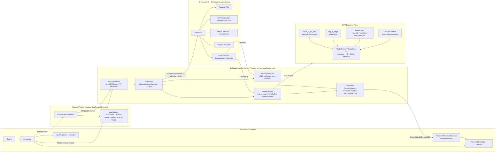
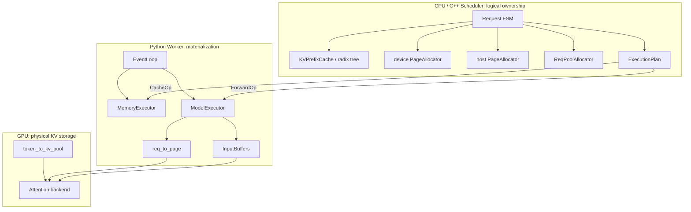

# TokenSpeed Runtime 架构纠偏 v0.2

本文作为本目录的架构主文档，目标是纠正一个过粗的理解：不能把 TokenSpeed 画成普通推理服务流水线 `AsyncLLM -> Scheduler -> ModelExecutor -> Model`。这个抽象会遗漏真正值得研究的运行时边界：Python/C++ 边界、CPU/GPU 边界、rank/DP/TP 边界、KV page ownership，以及 agentic workload 下短 decode、多轮 prefix、cache footprint 不均衡带来的系统问题。

正确的分析方式应该从“一个请求上下文在运行时跨哪些组件、由谁持有什么状态、哪些事件推进 KV 生命周期”开始。

## 0. 修正后的核心判断

TokenSpeed 的架构中心不是某个 kernel，也不是一个单独的 scheduler，而是五个运行时面组成的闭环：

1. **Python 前端进程**：`Engine / AsyncLLM`，负责请求接入、tokenize、前端 `ReqState`、stream collector、取消语义、inline detokenize。
2. **可选 Python DP Controller 进程**：`DataParallelController`，在 attention-DP 场景下把请求分发给不同 DP worker group。
3. **每个 rank 一个 Python Scheduler Worker 进程**：`EventLoop + RequestHandler + ModelExecutor + OutputProcessor`，是 Python runtime glue，不等同于 scheduler 本体。
4. **嵌入 worker 内的 C++ Scheduler**：`Request FSM + KVPrefixCache + PageAllocator + ReqPoolAllocator + ExecutionPlan`，是真正的 CPU 侧调度和 KV ownership 核心。
5. **GPU 执行面**：`token_to_kv_pool + req_to_page + InputBuffers + ForwardContext + ModelRunner`，负责把 C++ plan 物化为 GPU forward 可读的张量和 kernel 调用。

这意味着 PPT 中的架构图必须画出边界，而不是只画功能模块。

## 1. 运行时组件视图

这张图要表达的不是“TokenSpeed 有哪些包”，而是状态在哪里：

| 状态类别 | 主要组件 | 位置 | 作用 |
|---|---|---|---|
| 前端请求状态 | `AsyncLLM.rid_to_state` / `ReqState` | main Python process / CPU | 用户 coroutine、collector、取消/完成事件 |
| 调度状态 | C++ `Request` FSM | worker 内 C++ / CPU | Submitted、Prefilling、Decoding、Retracting、Draining、Finished |
| KV ownership 状态 | `KVPrefixCache`、`PageAllocator`、`ReqPoolAllocator` | worker 内 C++ / CPU | 哪些 page 归请求、prefix tree、host/device page lifetime |
| KV 物理张量 | `token_to_kv_pool` | GPU memory | attention backend 实际读写的 K/V tensor |
| 执行映射状态 | `req_to_page`、`InputBuffers`、`RuntimeStates` | Python worker + GPU tensors | 把 C++ ForwardOp 翻译成 GPU forward 输入 |
| 输出反馈状态 | generation `OutputProcessor.RequestState` | worker Python / CPU | token append、finish、reserve 更新、scheduler advance event |

## 2. 进程与边界

TokenSpeed 的运行时要按进程和边界拆，而不是按“前端/后端”泛泛划分。

### 2.1 Main Python Process

入口是 `python/tokenspeed/runtime/entrypoints/engine.py` 中的 `Engine`。当前 `engine.py` 顶部注释仍提到独立 DetokenizerManager，但实际 launch 逻辑已经把 detokenize 放在 `AsyncLLM` 的 output path 内联处理。主进程主要承担：

- 构造 `ServerArgs / PortArgs`。
- 启动 scheduler worker subprocess；attention-DP 场景下启动 `DataParallelController`。
- 通过 `AsyncLLM` 做 tokenization、front-end request state、collector、取消请求、stream output。
- 同步 API 通过 `LLM` facade bridge 到 `AsyncLLM`。

这层不是性能核心，但它决定 request cancellation、streaming backpressure、parallel sampling warmup、用户 coroutine 生命周期是否能正确释放 scheduler 资源。

### 2.2 DataParallelController Process

当 attention-DP 开启时，`DataParallelController` 插在 `AsyncLLM` 和 scheduler workers 之间。它不是模型执行组件，而是请求分发控制面：

- 从 `AsyncLLM` 侧 ZMQ PULL tokenized requests。
- 维护每个 DP worker 的 load budget。
- 支持 `ROUND_ROBIN`、`SHORTEST_QUEUE`、`MINIMUM_CACHE_USAGE`。
- 为每个 DP rank 创建到 scheduler worker 的 ZMQ PUSH socket。

对 agent workload，这一层值得单独研究：多轮会话会产生长期 KV footprint，如果 DP dispatch 只看请求数，不看 cache usage，某些 DP rank 可能被长会话 KV 压满，导致 p95 queue time 和 retraction 增加。TokenSpeed 至少在架构上把 cache usage 放进了 DP dispatch 的可用信号。

### 2.3 Scheduler Worker Python Process

每个 rank 一个 worker。这个 worker 不是单纯的“模型进程”，而是把 C++ Scheduler、cache executor、GPU executor、output feedback 串起来的 event loop。

关键组件：

- `RequestHandler`：attention TP rank0 从 ZMQ 接请求，然后广播给 TP group，保证各 rank 的 C++ scheduler mirror 输入一致。
- `EventLoop`：每轮做 admission、cache result commit、`scheduler.next_execution_plan()`、cache op submit、forward dispatch、output commit、scheduler.advance。
- `MemoryExecutor`：通用 hierarchical cache 的 loadback/writeback/prefetch executor。注意 DeepSeek V4 当前 baseline 不支持 hierarchical kvstore。
- `ModelExecutor`：GPU 执行物化层，负责 `req_to_page`、`InputBuffers`、`RuntimeStates`、CUDA graph / execution stream。
- `Generation OutputProcessor`：把 GPU 结果转成 `ExtendResult / Finish / UpdateReserveNumTokens` 等 scheduler event。

这层的关键不是“Python 调了模型”，而是 `event_loop_overlap()` 中 CPU 和 GPU 的错位执行：当前 step 的 forward 尽量先 launch，让 GPU 跑当前 step，同时 CPU commit 上一轮结果。

### 2.4 Embedded C++ Scheduler

C++ Scheduler 是 TokenSpeed KV 和请求生命周期的核心。Python worker 每个 rank 都嵌入一份 scheduler mirror；它们通过相同 request order 和 TP cache event common commit 保持一致。

内部关键结构：

- `Scheduler::SubmitRequests()`：把 `RequestSpec` 变成 C++ `Request`。
- `Scheduler::NextExecutionPlan()`：每轮生成 `ForwardOp + CacheOp`。
- `Request` FSM：用状态机表达 prefill、decode、retract、drain、finish。
- `KVPrefixCache`：prefix tree / radix tree，负责 prefix match、insert、evict。
- `PageAllocator`：device / host page free list。
- `ReqPoolAllocator`：GPU request slot 的生命周期。
- `HybridPrefixCache`：KV prefix cache 与 Mamba cache 的组合能力。
- `paged_cache_groups`：支持 full-history / sliding-window 等 paged cache group 表达。

这个部分才是“Scheduler + KV ownership”护城河的中心。vLLM 要复制，不是加一个 backend 参数，而是要把 KV page lifetime 纳入 scheduler state transition。

### 2.5 GPU Execution Plane

GPU 侧真正被 attention/backend 读写的是 `token_to_kv_pool`，不是 C++ Scheduler 里的 `KVPrefixCache`。两者关系是：

- C++ Scheduler 管逻辑 page ownership。
- Python `ModelExecutor` 把 ownership 物化到 `req_to_page` block table。
- `InputBuffers` 计算 `out_cache_loc`、positions、input ids、extend prefix lens。
- attention backend / `token_to_kv_pool` 按 `req_to_page + out_cache_loc` 读写物理 KV tensor。

因此报告里必须避免说“Scheduler 直接持有 GPU KV tensor”。更准确的说法是：Scheduler 持有 KV page 的逻辑所有权和生命周期，GPU pool 持有物理 KV 张量，`ModelExecutor` 是两者之间的翻译层。

## 3. KV Cache 管理机制

KV 管理要拆成两层 ownership：

### 3.1 请求进入 scheduler

`RequestSpec` 进入 C++ Scheduler 后变成 `Request`。此时请求主要持有 token container 和 FSM 状态，尚未真正占用完整 decode KV。

### 3.2 Prefill prefix match 与 page 分配

首次 prefill 时，scheduler 会：

- 按 block/page 粒度对 token prefix 做 `KVPrefixCache.Match()`。
- 命中部分作为 prefix pages 复用。
- 对未命中部分分配 device KV pages。
- 分配 req pool slot。
- 形成 prefill chunk 的 `ForwardOp`。
- 必要时生成 host/storage prefetch 或 loadback 相关 cache op。

这样 prefix reuse 不是 attention backend 自己决定的，而是在 schedule prefill 时就进入了 request FSM。

### 3.3 Decode reserve

prefill 完成后，`PrefillDone -> Decoding` 会为 decode reserve token slots。后续每轮 output commit 后，`Generation OutputProcessor` 会把实际 accept length / output length 回传给 scheduler，scheduler 再更新 reserve。spec decode 场景下这能避免静态过度预留。

### 3.4 Finish / Draining / WriteBack

请求结束时，不是简单释放 GPU page。scheduler 会根据 cache policy 决定：

- 已生成 token 是否插入 prefix cache，供后续多轮 prefix reuse。
- 是否需要 L2/host writeback。
- 何时释放 request-local pages。
- 何时释放 req pool slot。

这解释了为什么 KV ownership 必须和 Request FSM 绑定：finish 不是一个瞬时动作，而是可能经过 Draining / WritingBack 后才进入 Finished。

### 3.5 Retract / LoadBack

当 device KV 紧张时，scheduler 可以选择长 decode request 做 retract：

- 把部分 device pages 转入 prefix/host 侧可恢复状态。
- 请求进入 Retracted / Retracting 相关状态。
- 后续资源允许时通过 LoadBack 恢复，再继续 decode。

这个能力针对长上下文与高并发混合负载很关键：系统可以局部牺牲长请求驻留，而不是让所有请求因为 KV 不足停摆。

### 3.6 DeepSeek V4 的重要限制

当前代码里对 `DeepseekV4TokenToKVPool` 有明确限制：如果 `enable_kvstore` 开启，会抛 `NotImplementedError`，提示 DeepSeek V4 baseline 不支持 hierarchical cache，需要 `--disable-kvstore`。

因此 PPT 不能把 “L2/host KVStore + L3 storage” 当作 DeepSeek V4 已落地收益去讲。更准确的表达是：

- TokenSpeed 有通用 hierarchical cache / storage 架构。
- 但 DeepSeek V4 当前 baseline 路径不支持 hierarchical kvstore。
- 对 V4/Kimi 类 MoE，本阶段应重点看 device KV page ownership、prefix safe reuse、decode/prefill/retract/finish 生命周期，以及 latent/cache layout 与 paged cache group 表达。

## 4. Agentic Workload 优化点应该挂到运行时闭环上

Agent workload 的特征不是简单的“长上下文”，而是：

- 多轮会话反复携带相同 prefix。
- decode step 短，CPU 调度和 output commit 的间隙会被放大。
- tool call / structured output 可能引入 grammar 状态。
- 请求 churn 高，finish/cancel/retract 频繁。
- KV footprint 大，DP rank 间 cache usage 容易不均。
- MoE + DP 下某些 rank 可能没有 token，但仍必须参加 collective。

TokenSpeed 的优化点要对应这些具体问题：

| Agent workload 问题 | TokenSpeed 机制 | 应该观察的性能指标 |
|---|---|---|
| 多轮 prefix 重复 | C++ `KVPrefixCache` / prefix page reuse / finish 后可插入 cache | cached token ratio、prefill tokens saved、TTFT |
| 短 decode step 下 GPU idle gap 明显 | `event_loop_overlap()` 当前 forward 与上一轮 CPU commit overlap | GPU forward 间 gap、p95 ITL、scheduler iteration time |
| cancel / abort 高频 | `AsyncLLM` cancellation -> `AbortReq`，admission/output/grammar 都处理 abort race | wasted decode steps、active req cleanup latency |
| grammar 编译或 structured output | grammar ready 前不进入 scheduler；eager grammar 时 overlap loop 做正确性例外 | grammar queue time、p95 ITL、invalid token rejection |
| DP rank cache footprint 不均 | `DataParallelController` 支持 minimum-cache-usage / shortest-queue | pages per DP rank、waiting queue per rank、retraction count |
| MoE/DP 某 rank 无 token | DP metadata sync + idle forward 参与 collective | collective stall、zero-token rank count、tokens/rank variance |
| KV 不足但不能全局停摆 | scheduler retract / loadback / writeback FSM | retraction count、loadback stall、device KV active pages |
| mixed prefill/decode | `ExecutionPlan` 同时表达 `ForwardOp + CacheOp`，并有 mixed prefill decode 开关 | TTFT/ITL tradeoff、prefill/decode tokens per iteration |

这些点是后续性能收益模型的入口。不能简单把 “Scheduler/KV + parallel + local-SPMD + MLA” 的收益相加，而要按 workload 中的瓶颈迁移来建模。

## 5. 并行策略在架构图中的位置

并行策略不能只画在最右侧当“分布式层”。它实际影响三个位置：

1. **进程/rank topology**：attention TP/DP 决定 RequestHandler 的广播范围、DP Controller 是否存在、每个 DP worker 下有多少 TP rank。
2. **GPU forward 中的 token movement**：`Mapping / CommManager / MoE dispatcher` 决定 attention、dense、MoE 层之间怎么 all-reduce、all-gather、reduce-scatter、all-to-all。
3. **EventLoop 的 DP metadata sync**：DP ranks 每轮先 all-gather CPU metadata，决定是否 idle forward，以及 token-aware collective 的真实 token count。

因此“并行策略特别在哪里”不能只回答“支持 EP/TP/DP”。更准确的问题应该是：

- attention、dense、MoE 是否可以使用不同的并行组？
- 当 attention TP group 与 MoE TP+EP group 不一致时，模型层怎么把 hidden states 从一个 placement 转到另一个 placement？
- 通信是按 padded batch 做，还是按真实 token count 做？
- DP rank 无 token 时，是否仍能安全参与 MoE/dense collective？
- 对 DeepSeek V4 当前路径，哪些通信由显式 `CommManager` 完成，哪些可能由 generic placement compiler 完成？

当前已读代码支持一个重要纠偏：`local-SPMD / placement compiler` 是通用基础设施，存在于 `runtime/models/base/{placement.py, compiler.py, comm_ops.py}`；但 DeepSeek V4 decoder layer 当前读到的是显式 `CommManager` 路径。PPT 中必须区分：

- **已落地实际路径**：DeepSeek V4 forward 中的 `CommManager`、MoE backend、token-aware comm。
- **通用表达能力**：ModuleSpec placement annotation + compiler 插入 collectives。
- **待验证问题**：DeepSeek V4 是否、以及哪些部分实际经过 placement compiler。

## 6. 后续图应该如何重画

新的图不应该直接用 image generation 生成带文字的海报。应该先画三张确定性机制图，再决定是否用图像模型做无文字背景或局部视觉增强。

### 图 1：Runtime Boundary View

必须包含：

- Main Python process
- Optional DataParallelController process
- Scheduler Worker Python process per rank
- Embedded C++ Scheduler
- GPU execution plane
- ZMQ、TP broadcast、DP dispatch、scheduler mirror、NCCL/HCCL collective

### 图 2：KV Ownership View

必须包含：

- Request FSM 状态
- `KVPrefixCache / radix tree`
- device/host `PageAllocator`
- `ReqPoolAllocator`
- `ExecutionPlan`
- `MemoryExecutor`
- `ModelExecutor.req_to_page`
- GPU `token_to_kv_pool`
- finish/retract/loadback/writeback 的事件反馈

### 图 3：Agent Workload Optimization View

必须按问题挂机制：

- 多轮 prefix -> prefix cache / safe reuse
- 短 decode -> overlap event loop
- cache imbalance -> DP load balance by cache usage
- MoE/DP uneven token -> DP metadata sync + idle forward
- structured output -> grammar admission / eager grammar overlap exception
- KV pressure -> retract/loadback

这三张图比一张“大而全”架构图更适合 PPT。首页可以用 Runtime Boundary View，后面分别展开 KV 和 agent workload 优化。

## 7. 本目录文档体系

本目录后续阅读顺序应按“先整体 runtime，再请求流，再机制深挖”组织：

1. `01-runtime-architecture.md`：运行时组件、进程边界、CPU/GPU 边界、KV ownership 边界。
2. `02-request-lifecycle.md`：以一条 generate 请求为线索讲清楚上下文如何在系统内流动。
3. `03-agent-kv-management.md`：Scheduler/KV/EventLoop 如何服务 agent 场景。
4. `04-parallel-strategy-and-placement.md`：并行策略、Mapping、CommManager、placement compiler 和 DeepSeek V4 实际路径。
5. `05-performance-model-and-poc.md`：把机制转成 counter 和 PoC 胜负线。
6. `06-code-map-and-open-questions.md`：已读代码、负面结论和未闭合问题。

之前的 4+1 草稿可以作为中间材料，但不应再作为 PPT 架构主依据；PPT 应以本文的 runtime boundary view 和请求生命周期图为主。

## 8. 待补研究缺口

为了让 PPT 真正有深度，接下来还需要补三块代码证据：

1. **KVPrefixCache 内部机制**：radix tree node lifetime、lock/ref、evict、insert、match、host/device page accounting。
2. **MemoryExecutor 与 cache movement**：loadback/writeback/prefetch、stream fence、TP common cache event commit、DeepSeek V4 不支持 hierarchical kvstore 的影响。
3. **DeepSeek V4 并行路径**：`CommManager`、MoE backend、dispatcher、MegaMoE、DeepEP、token permutation/combine、expert location/EPLB，最终形成 token movement 账本。

只有这三块补齐，才能回答用户最关心的问题：TokenSpeed 的核心特性到底如何实现，vLLM/vLLM-Ascend 是 config 可复制、model patch 可复制，还是必须做架构级复制。
