# TokenSpeed 请求上下文执行图谱 v0.1

> 阅读说明：本文需要和 `01-runtime-architecture.md` 一起读。尤其要区分 Main Python process、DataParallelController process、Scheduler Worker Python process、嵌入式 C++ Scheduler、GPU execution plane；也要区分 C++ Scheduler 持有的是 KV page 的逻辑 ownership，而 GPU `token_to_kv_pool` 持有物理 KV tensor。

本文的目标不是再列一遍 TokenSpeed 的“功能模块”，而是用一个 generate 请求作为线索，把它在系统中如何被接入、调度、占用 KV、进入模型 forward、产生 token、再反向推进 scheduler 的闭环讲清楚。这个图谱会作为后续技术解读的主骨架：先讲请求生命周期，再把 Scheduler/KV、local-SPMD/Placement、并行策略三个深挖主题挂到真实执行链路上。

## 0. 核心判断

TokenSpeed 的请求上下文不是一个单一对象，而是四类状态的组合：

1. 前端状态：`AsyncLLM.rid_to_state` 中的 `ReqState`，负责用户 coroutine、输出 collector、取消/完成事件。
2. 调度状态：C++ `Scheduler` 内部的 `Request` FSM，负责 Submitted / Prefilling / PrefillDone / Decoding / Draining / Retracted / Finished 等生命周期。
3. 运行时张量状态：`ModelExecutor` 的 `req_to_page`、`InputBuffers`、`RuntimeStates.valid_cache_lengths`、`future_input_map` 等，负责把 C++ `ForwardOp` 变成 GPU forward 可读的张量。
4. 输出状态：`generation_output_processor.RequestState`，负责增量 detokenize 所需的 token 序列、finish reason、cached token 统计、grammar 状态和 scheduler advance event。

这意味着 TokenSpeed 的架构核心不是“某个 backend 很快”，而是一个多状态闭环：

```mermaid
flowchart LR
  A["GenerateReqInput"] --> B["AsyncLLM / InputProcessor<br/>tokenize + ReqState"]
  B --> C["EngineCoreClient / ZMQ"]
  C --> D["RequestHandler<br/>TP rank0 recv + TP broadcast"]
  D --> E["RequestSpec + Output RequestState"]
  E --> F["EventLoop admission<br/>grammar / abort / PD / L3 query"]
  F --> G["C++ Scheduler<br/>Request FSM + KV ownership"]
  G --> H["ExecutionPlan<br/>ForwardOp + CacheOp"]
  H --> I["MemoryExecutor<br/>prefetch / loadback / writeback"]
  H --> J["ModelExecutor<br/>req_to_page + InputBuffers + ForwardContext"]
  J --> K["Model forward<br/>attention / dense / MoE / comm"]
  K --> L["Sampling + output D2H"]
  L --> M["Generation OutputProcessor<br/>ExtendResult / Finish / Reserve"]
  M --> G
  M --> N["BatchTokenIDOut"]
  N --> O["AsyncLLM OutputProcessor<br/>inline detokenize + user response"]
```

## 1. 一条请求在系统中的执行路径

### S1. 前端接入：用户请求变成 tokenized request

代码入口在 `python/tokenspeed/runtime/engine/async_llm.py`。`AsyncLLM` 明确承担 request intake、per-request state、scheduler IPC、output-dispatch loop。单请求路径是：

- `generate_request()` 先做 request validation、batch normalization，然后调用 `_tokenize_one_request()`。
- `_send_one_request()` 创建前端 `ReqState`，放入 `rid_to_state`，再通过 `engine_core_client.send_to_scheduler.send_pyobj(tokenized_obj)` 送给 scheduler 进程。
- `_wait_one_response()` 等待该 rid 对应的 collector 产出；如果用户 coroutine 被取消，`finally` 会调用 `abort_request()` 发 `AbortReq`，避免 scheduler 继续烧 slot。

这里的优化点不是模型推理本身，而是控制面语义：取消请求必须能释放 scheduler slot；parallel sampling 会先 warmup common prefix，再复制请求，说明 prefix cache 被当成生成策略的一部分使用。

尚未充分覆盖：`InputProcessor.tokenize_one_request()` 还没有系统读完，特别是 multimodal、batch tokenize、parallel sampling warmup 对 prefill cache 命中率的影响。

### S2. IPC 与 TP 同步：rank0 接请求，TP group 同步

代码入口在 `request_handler.py`。`RequestHandler.recv_reqs()` 只让 `attn_tp_rank == 0` 从 ZMQ PULL socket 拉请求，然后用 `broadcast_pyobj()` 广播给 attention TP 组内其他 rank。这样保证每个 TP rank 上的 C++ scheduler 镜像看到相同请求序列。

这一点很重要：TokenSpeed 的 scheduler 是每个 rank 本地一份，但它要求 cache plan / forward plan 在 TP ranks 上一致。后面的 `_commit_cache_results()` 也会跨 TP ranks 对 cache event 做 common payload 对齐，确保 scheduler.advance 不会因为某个 rank 的异步 cache op 先完成而破坏镜像状态。

优化点：

- rank0 接入可以减少多 rank 重复拉取 IPC 的复杂性。
- TP 内广播把 request order 变成确定性输入，降低 C++ scheduler 分布式一致性成本。

潜在代价：

- 当 attention TP size 很大时，控制面广播会进入每轮调度开销。
- DP attention 下请求负载均衡和 TP 镜像同步叠在一起，后续需要读 DP load balancer 与 mini-lb 逻辑。

### S3. Admission：请求进入 scheduler 前先经过语义闸门

代码入口在 `event_loop.py::_process_new_requests()`。这段比“submit request”复杂得多：

- 接收并分发新请求、控制请求、abort。
- 对 abort 做 `output_processor.mark_abort()` 和 `grammar_manager.mark_abort()`，覆盖“grammar compile 中请求被取消”的竞态。
- 按 grammar ready 状态拆分请求；未 ready 的请求先进入 grammar queue，避免无效 grammar 占用 prefill slot。
- 如果是 PD decode 实例，设置 `computed_length = input_length`。
- 注册输出态 `output_processor.register()`。
- 如果启用 `memory_executor`，用 scheduler 计算 L3 query rolling hashes，并查询 storage hit pages，把 `rolling_hashes` 和 `storage_hit_pages` 写进 `RequestSpec`。
- 最后才 `scheduler.submit_requests(admitted_specs)`。

这一层说明 TokenSpeed 的 scheduler/KV 设计不是裸 scheduler：请求 admission 已经把 grammar、PD、L3 storage hints、abort races 这些系统语义纳入调度入口。

优化点：

- 无效 grammar 不占 prefill token budget。
- L3 hit pages 在 request submit 前写入 `RequestSpec`，使 C++ scheduler 能决定是否先发 PrefetchOp。
- abort 在 admission 前后都能落地，减少取消请求继续 decode 到 max_tokens 的风险。

尚未充分覆盖：grammar manager 的 compile queue、TP 同步 admission、失败/超时策略还没完整读；PD bootstrap 信息如何跨 prefill/decode 节点闭环也只读到 EventLoop 入口。

### S4. C++ Scheduler：请求被转换成 FSM 与资源所有权

代码入口在 `tokenspeed-scheduler/csrc/scheduler/scheduler.{h,cpp}`、`operations/forward.cpp`、`fsm/*`。

`Scheduler::SubmitRequests()` 会把 `RequestSpec` 转为 C++ `Request`。`Request` 内部持有 `TokenContainer` 和 FSM state；资源所有权不是散落在 Python 侧，而是在 state transition 时绑定到具体状态：

- `Submitted` 只持 token container，不持 allocator。
- `SchedulePrefillFirstChunkEvent` 匹配 prefix cache，必要时锁 host/device node，分配 local KV pages、req pool index、Mamba working/checkpoint slot。
- `Prefilling` 持有当前 chunk window、host node ref、device node ref、local KV allocator、req pool index。
- `PrefillDone -> Decoding` 会把已完成 prefill pages 插入 hybrid/prefix cache，然后为 decode reserve token slots。
- `FinishEvent` 进入 Draining/Finished；如需 L2 writeback，会产生 `WriteBackOp`。
- device 内存不足时，`newForwardOperation()` 选择最长 decode request retract，发 `WriteBackOp`，之后可从 `Retracted` 通过 `LoadBackOp` 恢复。

`NextExecutionPlan()` 每轮做四件事：

1. 先处理 Draining 请求的 writeback。
2. 清理 Finished 请求并释放 paged cache group。
3. 过滤掉 Draining / Prefetching / Retracting / WritingBack，得到可调度 candidates。
4. 调 `newForwardOperation()` 生成 `FlatForwardOperation`，同时可能生成 LoadBack/WriteBack cache ops。

`newForwardOperation()` 的调度优先级是：

- 正在 chunked prefill 的 `Prefilling`
- 新来的 `Submitted` / `PrefetchDone`
- `PrefillDone` / `Decoding`
- `Retracted`

这里能看出 TokenSpeed 的 scheduler/KV 护城河候选：KV page 不是模型 executor 的附属状态，而是 scheduler FSM 状态转移的一部分；forward op 和 cache op 是同一个 execution plan 的两类操作。

优化点：

- prefix cache 命中减少 prefill tokens。
- host L2 / storage L3 可以通过 Prefetch / LoadBack / WriteBack 与 forward plan 解耦。
- retraction 让系统在 device KV 紧张时牺牲长请求驻留，而不是全局停摆。
- `enable_mixed_prefill_decode` 控制 prefill/decode 是否混排；默认 prefill-first 逻辑避免 decode 被长 prefill 破坏，也能根据 workload 调整。
- paged cache group 支持 full-history/sliding-window，不只是普通 KV page table，给 DeepSeek V4 这类 latent/cache group 留了表达空间。

尚未充分覆盖：`KVPrefixCache`、radix tree node lock/ref lifetime、Host/Device allocator、HybridPrefixCache、Mamba cache 与 L3 storage 的内部实现还需要单独深挖。

### S5. Cache op：异步内存动作与 scheduler advance 对齐

Python 侧在 `EventLoop._submit_cache_ops()` 把 execution plan 中的 `CacheOp` 提交给 `MemoryExecutor`，并记录 inflight cache op 数。`_commit_cache_results()` 轮询 `memory_executor.poll_results()`，把 cache event 转成 payload；TP size > 1 时通过 all_gather 找到所有 ranks 都完成的 common cache event，再统一 `scheduler.advance(ec)`。

这个设计解决的是分布式 scheduler 镜像一致性问题：如果每个 TP rank 独立看到 cache op 完成顺序，FSM 可能分叉；TokenSpeed 用 common payload commit 保证所有 TP rank 只推进共同完成的 op。

优化点：

- cache op 与 forward op 分离，可以做 async prefetch/loadback/writeback。
- `_setup_layerwise_loadback()` 暗示 loadback 可做 layerwise consumer 设置；writeback 与 forward 之间通过 stream fence 避免同一 KV slot 被重用后读写乱序。

尚未充分覆盖：`MemoryExecutor`、`HostExecutor`、storage backend、layerwise loadback 的真实 overlap 时序还没有读透，这是 Scheduler/KV 深挖必须补的缺口。

### S6. Forward op：C++ plan 变成 GPU 可执行张量

`EventLoop._dispatch_forward()` 先调用 `model_executor.update_block_table(forward_op)`，把 scheduler 给出的 request pages 写进 `req_to_page`。再根据 PD 模式选择正常 forward、decode RDMA receive、prefill KV send 等路径。普通路径会调用：

- `reset_valid_cache_length(forward_op)`：prefill 时把 `valid_cache_lengths` 重置到 prefix lens；retraction recovery 时用 `hist_token_lens` 修正历史 KV 长度。
- `execute_forward_op_with_log()` / `execute_forward_op()`。

`ModelExecutor` 里核心状态包括：

- `req_to_page`：request-pool-index 到 page ids 的 block table。
- `InputBuffers`：预分配 input ids、positions、input lengths、req pool indices、out cache loc、extend prefix lens 等 GPU buffer。
- `RuntimeStates.valid_cache_lengths`：每个 req pool slot 当前有效 KV 长度。
- `RuntimeStates.future_input_map`：decode 下一轮输入 token 的 slot-indexed map。

`InputBuffers.fill_input_buffers()` 会：

- 复制 request pool indices / input lengths 到 GPU。
- 对 prefill 写入 `extend_prefix_lens` 和 `extend_seq_lens`。
- 用 `valid_cache_lengths` 和 `req_to_page` 计算 `out_cache_loc`。
- 计算 position ids。
- prefill token 从 `forward_op.input_ids` 进入 GPU；decode token 从 `future_input_map` 取；retracted decode 可用 `forward_op.decode_input_ids` 覆盖。
- 对 CUDA graph padding 区域写 dummy KV slot，避免 replay 污染真实 KV。

这层是 scheduler 与 kernel execution 的接口。如果这里没有讲清楚，报告中的“KV ownership”就会变成空话。

优化点：

- 输入 buffer 预分配，减少每轮张量创建。
- pinned CPU tensor + non_blocking copy 减少 H2D 同步开销。
- `total_tokens == 0` 的 fully prefix-cached prefill 可以不跑模型，直接产生空输出。
- CUDA graph wrapper 可以复用静态形状；DP 下用全局 batch/token metadata 选 common padded shape。

尚未充分覆盖：`CudaGraphWrapper` 的捕获策略、attention backend metadata 构建、`cache_loc_kernel` 细节还没有完整串起来。

### S7. Event loop overlap：CPU commit 与 GPU forward 的错位执行

TokenSpeed 有非 overlap 和 overlap 两个 loop。`event_loop_overlap()` 的关键顺序是：

1. default stream 等上一轮 execution stream，避免 block table / prefix cache 写和上一轮 forward 读冲突。
2. admission、cache result commit、scheduler plan、cache op submit。
3. 先收集当前 step 的 sampling params / grammar state。
4. DP sync。
5. 尽量先 dispatch 当前 forward，让 GPU 跑当前 step。
6. 再 commit 上一轮 results，让 CPU sync/post-process 与当前 GPU forward overlap。
7. 把 previous results 产生的 `ExtendResult/Finish/UpdateReserve` advance 回 C++ scheduler。

这个设计针对 agentic workload 的短 decode step 很关键：decode 单步很短，如果 CPU postprocess、detokenize、scheduler.advance 插在每次 forward 前面，GPU trace 会出现间隙。

例外是 eager grammar：如果当前 batch 带 grammar，而上一轮 matcher 还没 advance，必须先 commit prev results，否则 grammar mask 会用旧状态。

优化点：

- decode step 下 CPU/GPU overlap 减少 ITL。
- DP idle rank 通过 zero-token forward 参与 MoE/dense collectives，避免某些 rank 无请求时 collective hang。
- Mamba checkpoint 在 overlap decode 前 snapshot，避免上一轮结果还未 commit 时同 slot 状态被下一轮覆盖。

尚未充分覆盖：实际 overlap 收益需要 profiler trace；grammar eager/capturable 两条路径对 p95 的影响还未量化。

### S8. Model forward 与并行策略：真实 DeepSeek V4 path 目前以 CommManager 为主

`ModelRunner.forward()` 把 `ForwardContext`、input ids、positions、out cache loc、input lengths 等传给模型。对 DeepSeek V4，代码路径在 `runtime/models/deepseek_v4.py`：

- `DeepseekV4Model` embedding 使用 attention TP mapping。
- 每个 `DeepseekV4DecoderLayer` 包含 attention、DeepSeek V4 MoE、hidden compression pre/post。
- FFN/MoE 前后显式调用 `CommManager.pre_mlp_comm()` 与 `post_mlp_comm()`。
- hash-routed MoE 还会对 `input_ids` 做 `_pre_mlp_input_ids_comm()`，保证 router 所需 token ids 与 MoE token 重排后的 hidden states 对齐。
- MegaMoE path 会绕过普通 pre/post MoE comm，直接用 `moe_tp_ep_group_scattered_num_tokens(ctx)` 给 backend。

这里必须纠偏：`local-SPMD / placement compiler` 确实存在于 `runtime/models/base/{placement.py,compiler.py,comm_ops.py}`，它能基于 `ModuleSpec` 的 input/output placement 自动插入 AllGather、ReduceScatter、AllReduce、ResidualAllGather、ResidualSlice、FusedReduceNorm 等 `CommOp`。但在当前读到的 DeepSeek V4 实际执行链中，decoder layer 仍是显式 `CommManager` 接线，而不是通过 `compile_decoder_layer()` 生成 `CompiledDecoderLayer`。

所以并行策略这一章应分成两层：

- 已落地的实际路径：Mapping + CommManager + DeepSeek V4/MoE backend 如何在请求 forward 时根据真实 token counts 做通信。
- 通用建模基础设施：Placement compiler 如何把“模块输入/输出分布状态”变成通信 op；它是否覆盖 DeepSeek V4，需要继续验证，不能在报告里直接当成 DeepSeek V4 已用事实。

优化点：

- attention / dense / MoE mapping 分开建模，`Mapping` 支持 attn TP/CP/DP、dense TP/DP、MoE TP/EP/DP。
- `CommManager` 的 token-aware all_gather / reduce_scatter 使用 `ForwardContext.global_num_tokens` 或当前 `input_num_tokens` 计算每个 rank 的真实 token count，不按最大 batch 盲目通信。
- 如果 attention TP size 与 MoE TP+EP size 相同，可以走 all-reduce 模式；否则走 token all-gather + reduce-scatter，这解释了“并行策略特别在哪里”不是支持 EP，而是不同 layer family 的通信边界可切换。
- DP idle forward 让 MoE collectives 在不均衡 DP 请求分配下仍能正确推进。

尚未充分覆盖：普通 `MoELayer` 内部 backend selector、DeepEP dispatcher、token permutation/combine、expert location / EPLB、MegaMoE backend 的完整路径还没读完。并行策略的性能收益必须落到这些 token movement 和 collective 计数上。

### S9. Sampling、输出处理与 scheduler 反向推进

`ModelExecutor._forward_step()` 内部先跑 target model forward，再 sampling；如果有 drafter，会 verify / run drafter，并写 `future_input_map`。之后 `_update_runtime_state()` 根据 accept length 或 input length 更新 `valid_cache_lengths`。最后 output tokens / lengths / logprobs 异步 D2H，并返回带 `copy_event` 的 `ModelExecutionResult`。

`generation_output_processor.post_process_forward_op()` 会等待 copy event，更新 per-request output state，然后产生 scheduler events：

- 每个请求先发 `ExtendResult`，把新 token 写回 C++ `Request` 的 token container。
- 如果请求 finished，发 `Finish`，触发 C++ `FinishEvent`，释放/写回 KV。
- 如果普通 decode 还没 finished，发 `UpdateReserveNumTokens`，让下一次 schedule decode 时按实际 accept length 预留 KV slots。

输出侧用 `BatchTokenIDOut` 直接发回 AsyncLLM 的 tokenizer IPC socket。AsyncLLM 的 `OutputProcessor.handle_batch_output()` 做 inline detokenizer、collector put、event set，用户 coroutine 被唤醒并 yield response。

优化点：

- scheduler 的下一轮 reserve token 数来自本轮实际 output length，spec decode 下能避免过度预留。
- output D2H 与 forward stream 分离，commit 可与下一轮 forward overlap。
- inline detokenizer 减少独立 detokenizer 进程路径，但也把部分 CPU work 放回主进程。

尚未充分覆盖：logprob、metrics、detokenizer streaming interval 对 p95 latency 的影响没有量化；多 batch streaming collector 的 backpressure 还没读。

## 2. 这条链路上真正可能产生性能收益的位置

| 位置 | 性能收益来源 | 可能移动的指标 | 迁移到 vLLM/vLLM-Ascend 难度初判 |
|---|---|---|---|
| Admission + abort + grammar | 无效请求不占 scheduler slot；取消请求及时释放 slot；grammar compile 不阻塞正常请求 | waiting queue、active req、wasted decode steps、p95 queue time | 中等，偏控制面改造 |
| Scheduler FSM + KV ownership | prefix hit、chunked prefill、decode reserve、retraction、finish writeback 统一进 FSM | cached token ratio、KV page active/cached、retraction 次数、TTFT/ITL | 高，属于架构级复制 |
| Cache op 与 forward op 分离 | L2/L3 prefetch/loadback/writeback 可与 forward 解耦，TP ranks 一致 commit | loadback stall、writeback stall、device KV pressure、GPU gap | 高，需要 scheduler/cache executor 联动 |
| Overlap event loop | 当前 GPU forward 与上一轮 CPU postprocess 重叠 | GPU idle gap、p95 ITL、scheduler iteration time | 中高，vLLM 有异步机制但语义不等价 |
| DP idle forward + token metadata | DP rank 无请求也参与 collective；MoE/dense collective 不 hang；选择 common graph shape | collective hang/stall、DP imbalance、tokens/rank variance | 中高，取决于 vLLM-Ascend DP/MoE runtime |
| Mapping + token-aware comm | attention/dense/MoE group 不强制一致；token all-gather/reduce-scatter 按真实 token counts | collective bytes、all-gather/reduce-scatter time、MoE all-to-all pressure | 高，需模型层/通信层协同 |
| InputBuffers + CUDA graph | 预分配张量、dummy slot padding、graph replay | per-step CPU overhead、H2D copy、decode latency variance | 中等，后端相关 |
| DeepSeek V4 latent/cache execution | compressed cache slot mapping、paged cache group、indexer/topk/cache insert | attention kernel time、KV bytes/token、decode memory bandwidth | 中等到高；MLA kernel 本身 vLLM 已吸收，端到端 cache layout 仍需看 |

粗略性能模型不能简单相加。建议把收益拆成三类：

- 降低无效工作：prefix/L3 hit、grammar admission、abort、fully cached prefill。
- 缩短关键路径：overlap loop、input buffer、CUDA graph、inline detokenize/streaming。
- 改变通信量或通信同步方式：token-aware TP/EP/DP collective、idle forward、MoE dispatch/combine。

对 910C + 950DT，最需要验证的是第三类，因为不同并行策略在 Ascend collective/all-to-all 上的瓶颈可能和 NVIDIA 不同。

## 3. 当前遗漏：下一轮必须补齐的执行链路空洞

### A. 请求入口和负载均衡还没闭环

已读：`AsyncLLM`、`RequestHandler`、`EventLoop._process_new_requests()`。

未读透：

- `InputProcessor` tokenization/multimodal/batch tokenize。
- `EngineCoreClient` socket 建立、scheduler subprocess lifecycle。
- DP load balancer 如何选择 rank，`GetLoadReqInput/GetLoadReqOutput` 如何被上层使用。

为什么重要：如果报告要回答 agentic workload p95 latency，只看 GPU forward 不够，请求入口排队和 DP routing 会直接影响 p95。

### B. KV ownership 的底层 allocator/cache tree 还没读完

已读：C++ Request FSM、schedule prefill/decode/retract、LoadBack/WriteBack/Prefetch 生成、Python cache event commit。

未读透：

- `KVPrefixCache` radix tree：device/host node ref、lock、eviction、Touch/LRU。
- `PageAllocator`、`LocalKVAllocator`、`OwnedPages` 生命周期。
- `MemoryExecutor`/`HostExecutor`：host/device/storage copy 的 stream、layerwise loadback、prefetch 的实际异步行为。
- L3 storage backend 和 rolling hash 的一致性边界。

为什么重要：Scheduler/KV 是否构成护城河，关键证据就在“页面所有权和异步搬运是否可安全复用”，而不是 API 层说支持 prefix cache。

### C. ForwardContext 到 attention backend 的 metadata 还没完整串起来

已读：`ModelExecutor`、`InputBuffers`、`RuntimeStates`、DeepSeek V4 部分 attention/MoE 入口。

未读透：

- `create_attn_components()` 如何选择 DeepSeek V4 token_to_kv_pool / attention backend。
- `DeepseekV4TokenToKVPool` 的 paged cache group spec 如何落到 scheduler `PagedCacheGroupConfig`。
- `deepseek_v4.py` backend metadata：compressed slot mapping、indexer cache、CSA/HCA cache table、prefill/decode metadata。
- `deepseek_v4_ops.py` 与 `tokenspeed-kernel` 的边界。

为什么重要：MLA/latent-KV 权重虽然在报告中应降低，但作为 DeepSeek V4 请求链的一段实现仍要讲清楚，否则 KV page 与 latent cache group 如何进入 kernel 会断。

### D. local-SPMD / placement compiler 的实际覆盖范围还没验证

已读：`placement.py`、`compiler.py`、`comm_ops.py`，确认存在 Placement type system 和 compiler-inserted CommOps。

关键发现：DeepSeek V4 当前读到的实际 forward path 使用显式 `CommManager`，而不是 `compile_decoder_layer()`。所以报告中不能说 DeepSeek V4 的并行策略已经由 local-SPMD compiler 全自动落地，除非继续找到调用链证据。

下一步要查：

- 哪些模型实际调用 `compile_decoder_layer()`。
- DeepSeek V4 是否计划迁移到 ModuleSpec，还是保留手写 CommManager。
- Placement compiler 与旧 CommManager 的功能重叠/差异：尤其 residual placement、fused reduce norm、token-aware scattered counts。

为什么重要：这决定“local-SPMD 是护城河”还是“有潜力但未完全落到目标模型路径”。

### E. 并行策略的收益还没落到通信账本

已读：`Mapping`、`CommManager`、DeepSeek V4 decoder/MoE 前后通信、部分 MoE backend 入口。

未读透：

- `MoELayer` 的 dispatch/combine、TopK、backend selector。
- DeepEP dispatcher、local compute、expert location、EPLB。
- dense TP / attention TP / MoE TP+EP 不同组合下每层 collective 序列。
- `ctx.global_num_tokens` 在 DP + MoE 下如何影响 token-aware collective bytes。

为什么重要：用户指出“支持 EP 本身大家都差不多”。要证明 TokenSpeed 并行策略特别，必须输出每种 layer family 的 communication plan，而不是列 Mapping/CommManager 名字。

## 4. 这份架构图谱如何重塑技术解读

正式报告不应该先讲四个护城河候选，而应该先讲一条请求链路：

1. 一条请求进来后，TokenSpeed 维护四套状态：frontend、scheduler FSM、runtime tensor、output。
2. Scheduler/KV 是请求生命周期的“资源所有权层”：决定 token 什么时候占 page、什么时候进入 prefix tree、什么时候写回/撤回。
3. Forward execution 是“计划落地层”：C++ `ForwardOp` 被转换成 `req_to_page/InputBuffers/ForwardContext`，再交给 attention/MoE/comm。
4. 并行策略是“模型 forward 中的通信计划层”：在真实 token counts 和 layer family group 之间选择 all-reduce 或 token all-gather/reduce-scatter。
5. local-SPMD/placement compiler 是“把通信计划系统化表达”的候选机制，但需要区分已在 DeepSeek V4 path 使用的 CommManager 与通用 compiler infrastructure。
6. MLA/latent-KV execution 是模型-specific backend 实现，介绍实现即可，不应压过 Scheduler/KV 与并行策略。

这能避免上一版材料的问题：看似覆盖很多点，但没有回答“一个请求到底经过哪些状态，TokenSpeed 在哪里做了和 vLLM 不一样的系统决策”。

## 5. 后续补强方向

1. 补 KV ownership 底层证据：读 `KVPrefixCache`、allocator、MemoryExecutor/HostExecutor，画 page ownership/state transition 图。
2. 补并行策略通信账本：以 DeepSeek V4 decoder layer 为单位，列 attention/HC/MoE 前后每个 collective、group、token count、条件分支。
3. 补 local-SPMD 使用范围：查 `compile_decoder_layer()` 调用链，明确它对目标模型是已用、可迁移，还是目前只是一套通用框架。
4. 补 attention latent cache 轻量实现图：只讲 `ForwardOp -> paged cache block tables -> DeepSeek V4 metadata -> kernel/cache insert/read`。
5. 把这四份材料重新整理成正式报告结构，每个小节只保留一个机制图、一个结论和一个 vLLM 可复制性判断。
