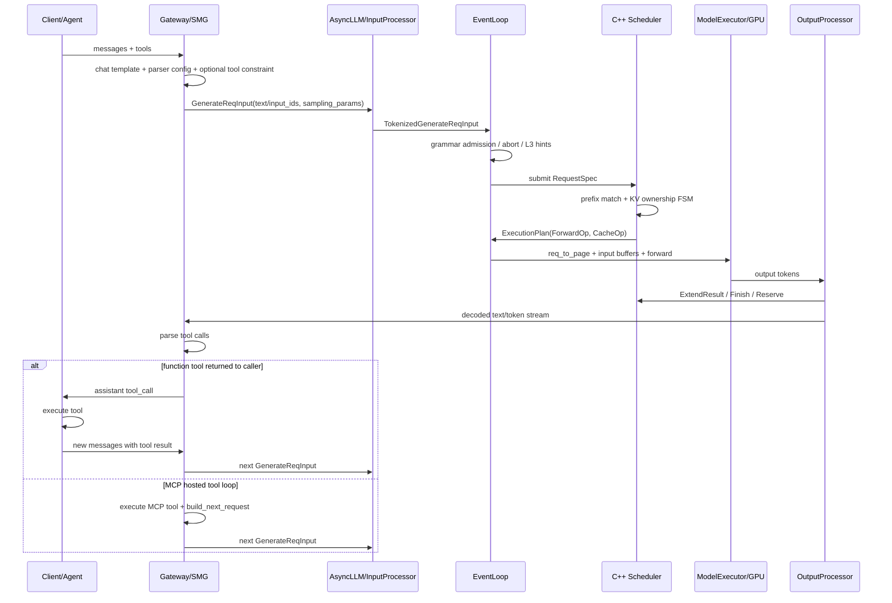

# TokenSpeed 请求上下文执行图谱 v0.2

> 阅读说明：本文需要和 `01-runtime-architecture.md` 一起读。尤其要区分 Main Python process、DataParallelController process、Scheduler Worker Python process、嵌入式 C++ Scheduler、GPU execution plane；也要区分 C++ Scheduler 持有的是 KV page 的逻辑 ownership，而 GPU `token_to_kv_pool` 持有物理 KV tensor。

本文的目标不是再列一遍 TokenSpeed 的“功能模块”，而是用一个 generate 请求作为线索，把它在系统中如何被接入、调度、占用 KV、进入模型 forward、产生 token、再反向推进 scheduler 的闭环讲清楚。本版补齐旧版遗留问题，并额外用一条“带 tool call 的消息请求”串流程，明确哪些行为属于 TokenSpeed runtime，哪些属于 OpenAI-compatible gateway 或上层 agent runtime。

## 0. 本次闭环结论

1. `GenerateReqInput` 在核心 runtime 内没有一等的 `tools` 字段。tool schema / tool call 格式主要在 SMG gateway、chat template、tokenizer wrapper、tool parser 层处理；进入 `AsyncLLM -> InputProcessor -> Scheduler` 后，本质上是普通 `text/input_ids + sampling_params` 请求。
2. tool call 不会触发一条独立的 C++ Scheduler 状态，也没有在当前代码路径中看到“tool call 后把该请求 KV 主动搬到 DDR，等待工具返回后用同一 rid 恢复”的逻辑。Scheduler/KV 仍按普通 finish、prefix cache、L2/L3 cache、retraction/writeback 语义工作。
3. 对 agentic workload 有价值的不是“识别了 tool call”本身，而是：tool schema/系统 prompt/多轮历史能否被 prefix cache 复用；短 decode step 的 CPU/GPU overlap 是否减少 ITL；grammar/structured output 是否在 admission 前被处理，避免坏请求占用 prefill slot。
4. DeepSeek V4 baseline 当前显式不支持 hierarchical kvstore：`EventLoop` 发现 `DeepseekV4TokenToKVPool` 且 `--enable-kvstore` 时会抛 `NotImplementedError`。因此，不能在 DeepSeek V4 + tool call 场景里声称已经存在 host DDR KV offload/resume 能力。
5. 旧版“遗留问题”已经分流：请求生命周期、InputProcessor、grammar admission、tool-call 解析位置在本文闭环；KV allocator/radix/MemoryExecutor 深水区放到 `03-agent-kv-management.md`；local-SPMD/并行策略放到后续专题，不再作为 02 文档的未完成项。

## 1. 一条请求的运行时视图

TokenSpeed 的请求上下文不是一个单一对象，而是四类状态的组合：

1. 前端状态：`AsyncLLM.rid_to_state` 中的 `ReqState`，负责用户 coroutine、输出 collector、取消/完成事件。
2. 调度状态：C++ `Scheduler` 内部的 `Request` FSM，负责 Submitted / Prefilling / PrefillDone / Decoding / Draining / Retracted / Finished 等生命周期。
3. 运行时张量状态：`ModelExecutor` 的 `req_to_page`、`InputBuffers`、`RuntimeStates.valid_cache_lengths`、`future_input_map` 等，负责把 C++ `ForwardOp` 变成 GPU forward 可读的张量。
4. 输出状态：`generation_output_processor.RequestState`，负责增量 detokenize 所需的 token 序列、finish reason、cached token 统计、grammar 状态和 scheduler advance event。

这意味着 TokenSpeed 的架构核心不是“某个 backend 很快”，而是一个多状态闭环：

```mermaid
flowchart LR
  A["OpenAI/gateway<br/>messages, tools, parser"] --> B["GenerateReqInput<br/>text/input_ids + sampling_params"]
  B --> C["AsyncLLM / InputProcessor<br/>tokenize + ReqState"]
  C --> D["EngineCoreClient / ZMQ"]
  D --> E["RequestHandler<br/>TP rank0 recv + TP broadcast"]
  E --> F["RequestSpec + Output RequestState"]
  F --> G["EventLoop admission<br/>grammar / abort / PD / L3 query"]
  G --> H["C++ Scheduler<br/>Request FSM + KV ownership"]
  H --> I["ExecutionPlan<br/>ForwardOp + CacheOp"]
  I --> J["MemoryExecutor<br/>prefetch / loadback / writeback"]
  I --> K["ModelExecutor<br/>req_to_page + InputBuffers + ForwardContext"]
  K --> L["Model forward<br/>attention / dense / MoE / comm"]
  L --> M["Sampling + output D2H"]
  M --> N["Generation OutputProcessor<br/>ExtendResult / Finish / Reserve"]
  N --> H
  N --> O["BatchTokenIDOut"]
  O --> P["AsyncLLM OutputProcessor<br/>inline detokenize + user response"]
  P --> Q["gateway parser<br/>reasoning/tool call extraction"]
```



这里要特别注意：图上的 gateway/parser 是运行时边界外的 OpenAI-compatible 层。TokenSpeed runtime 的 Scheduler/KV 并不感知“这是一个 tool call”，它只感知 token、sampling 参数、grammar、finish reason、KV page ownership。

## 2. 普通 generate 请求的执行路径

### S1. 前端接入：用户请求变成 tokenized request

代码入口在 `python/tokenspeed/runtime/engine/async_llm.py` 和 `python/tokenspeed/runtime/engine/input_processor.py`。`AsyncLLM` 负责 request intake、per-request state、scheduler IPC、output-dispatch loop；`InputProcessor` 负责 validation、tokenization 和 batch/parallel-sampling fan-out 前的 tokenized object 构造。

单请求路径是：

- `generate_request()` 做 request validation、batch normalization，然后调用 `_tokenize_one_request()`。
- `InputProcessor.tokenize_one_request()` 读取 `obj.text` / `obj.input_ids` / `obj.input_embeds`，必要时调用 tokenizer encode，把 `sampling_params` 转成 `SamplingParams`，再返回 `TokenizedGenerateReqInput`。
- `_send_one_request()` 创建前端 `ReqState`，放入 `rid_to_state`，再通过 `engine_core_client.send_to_scheduler.send_pyobj(tokenized_obj)` 送给 scheduler 进程。
- `_wait_one_response()` 等待该 rid 对应的 collector 产出；如果用户 coroutine 被取消，`finally` 会调用 `abort_request()` 发 `AbortReq`，避免 scheduler 继续烧 slot。

本轮闭环后的关键观察：

- `GenerateReqInput` 有 `text/input_ids/input_embeds/image/video/audio/sampling_params/session_params`，但没有 `tools` 字段。工具定义必须在进入 runtime 前被渲染进 prompt，或者由模型 tokenizer wrapper 的 `apply_chat_template(..., tools=...)` 处理。
- `InputProcessor` 会在 `reasoning_parser` 存在且请求带 `json_schema` 时，把普通 JSON grammar 包成 `structural_tag`，让 reasoning token 先生成，再约束最终 response。这个点对 tool-call argument JSON 很重要，但它是 grammar/structured-output 逻辑，不是 scheduler 的 tool-call 特化逻辑。
- `input_embeds` 与 prefix caching 互斥；这意味着要研究 agent 场景 prefix reuse，必须关注文本/token prompt 路径，而不是 embedding-only 路径。
- parallel sampling 会先 warmup common prefix，再复制请求，说明 prefix cache 被当成生成策略的一部分使用。

### S2. IPC 与 TP 同步：rank0 接请求，TP group 同步

代码入口在 `request_handler.py`。`RequestHandler.recv_reqs()` 只让 `attn_tp_rank == 0` 从 ZMQ PULL socket 拉请求，然后用 `broadcast_pyobj()` 广播给 attention TP 组内其他 rank。这样保证每个 TP rank 上的 C++ scheduler 镜像看到相同请求序列。

这一点很重要：TokenSpeed 的 scheduler 是每个 rank 本地一份，但它要求 cache plan / forward plan 在 TP ranks 上一致。后面的 `_commit_cache_results()` 也会跨 TP ranks 对 cache event 做 common payload 对齐，确保 scheduler.advance 不会因为某个 rank 的异步 cache op 先完成而破坏镜像状态。

优化含义：

- rank0 接入减少多 rank 重复拉取 IPC 的复杂性。
- TP 内广播把 request order 变成确定性输入，降低 C++ scheduler 分布式一致性成本。
- 代价是 attention TP size 较大时，控制面广播和 cache-event consensus 会进入每轮调度开销。

### S3. Admission：请求进入 scheduler 前先经过语义闸门

代码入口在 `event_loop.py::_process_new_requests()` 和 `grammar/grammar_manager.py`。这段比“submit request”复杂得多：

- 接收并分发新请求、控制请求、abort。
- 对 abort 做 `output_processor.mark_abort()` 和 `grammar_manager.mark_abort()`，覆盖“grammar compile 中请求被取消”的竞态。
- 对带 grammar 的请求先调用 `GrammarManager.process_req_with_grammar()`；如果 grammar 还在编译，先进入 grammar queue，不直接占用 scheduler prefill slot。
- `GrammarManager.get_ready_grammar_requests()` 每轮扫描 future。attention TP size > 1 时，会用 `all_gather_object()` 做 ready set 交集和 failed set 并集，保证各 TP rank admission 一致。
- grammar timeout 分两阶段处理：排队等待 executor worker 的时间、worker 真正开始编译后的时间分开算；timeout 结果会记录到 backend cache，避免同一坏 grammar 在并发请求中反复占用编译资源。
- 如果是 PD decode 实例，设置 `computed_length = input_length`。
- 注册输出态 `output_processor.register()`。
- 如果启用 `memory_executor`，用 scheduler 计算 L3 query rolling hashes，并查询 storage hit pages，把 `rolling_hashes` 和 `storage_hit_pages` 写进 `RequestSpec`。
- 最后才 `scheduler.submit_requests(admitted_specs)`。

这说明 TokenSpeed 的 scheduler/KV 设计不是裸 scheduler：请求 admission 已经把 grammar、PD、L3 storage hints、abort races 这些系统语义纳入调度入口。

对 agentic workload 的直接价值：

- tool-call argument 如果使用 JSON schema 约束，坏 grammar 或慢 compile 不会占用 prefill/decode token budget。
- 用户取消或上层 agent 放弃某个 tool-call 分支时，abort 能在 admission 前后落地，减少无效 decode。
- TP rank admission 一致性避免“某个 rank 觉得 grammar ready、另一个 rank 还在等”导致的 scheduler 镜像分叉。

### S4. C++ Scheduler：请求被转换成 FSM 与资源所有权

代码入口在 `tokenspeed-scheduler/csrc/scheduler/scheduler.{h,cpp}`、`operations/forward.cpp`、`fsm/*`。

`Scheduler::SubmitRequests()` 会把 `RequestSpec` 转为 C++ `Request`。`Request` 内部持有 `TokenContainer` 和 FSM state；资源所有权不是散落在 Python 侧，而是在 state transition 时绑定到具体状态：

- `Submitted` 只持 token container，不持 allocator。
- `SchedulePrefillFirstChunkEvent` 匹配 prefix cache，必要时锁 host/device node，分配 local KV pages、req pool index、Mamba working/checkpoint slot。
- `Prefilling` 持有当前 chunk window、host node ref、device node ref、local KV allocator、req pool index。
- `PrefillDone -> Decoding` 会把已完成 prefill pages 插入 hybrid/prefix cache，然后为 decode reserve token slots。
- `FinishEvent` 进入 Draining/Finished；如需 L2 writeback，会产生 `WriteBackOp`。
- device 内存不足时，`newForwardOperation()` 选择最长 decode request retract，发 `WriteBackOp`，之后可从 `Retracted` 通过 `LoadBackOp` 恢复。

`NextExecutionPlan()` 每轮做四件事：

1. 先处理 Draining 请求的 writeback。
2. 清理 Finished 请求并释放 paged cache group。
3. 过滤掉 Draining / Prefetching / Retracting / WritingBack，得到可调度 candidates。
4. 调 `newForwardOperation()` 生成 `FlatForwardOperation`，同时可能生成 LoadBack/WriteBack cache ops。

这里能看出 TokenSpeed 的 scheduler/KV 护城河候选：KV page 不是模型 executor 的附属状态，而是 scheduler FSM 状态转移的一部分；forward op 和 cache op 是同一个 execution plan 的两类操作。

### S5. Cache op：异步内存动作与 scheduler advance 对齐

Python 侧在 `EventLoop._submit_cache_ops()` 把 execution plan 中的 `CacheOp` 提交给 `MemoryExecutor`，并记录 inflight cache op 数。`_commit_cache_results()` 轮询 `memory_executor.poll_results()`，把 cache event 转成 payload；TP size > 1 时通过 all-gather 找到所有 ranks 都完成的 common cache event，再统一 `scheduler.advance(ec)`。

这个设计解决的是分布式 scheduler 镜像一致性问题：如果每个 TP rank 独立看到 cache op 完成顺序，FSM 可能分叉；TokenSpeed 用 common payload commit 保证所有 TP rank 只推进共同完成的 op。

边界必须写清楚：

- Cache op 与 forward op 分离，支持 async prefetch/loadback/writeback，这是 TokenSpeed KV ownership 的核心机制之一。
- 但在 DeepSeek V4 baseline 路径中，如果 `token_to_kv_pool` 是 `DeepseekV4TokenToKVPool`，`--enable-kvstore` 会直接报 `NotImplementedError`，`memory_executor = None`。所以不能把普通 KVStore/L2/L3 能力无条件套到 DeepSeek V4 + tool call 场景。
- tool call finish 后是否能靠 host DDR 保留 KV，不是本文代码路径已证明的事实；当前可证明的是普通 prefix cache / scheduler finish / optional writeback 机制。

### S6. Forward op：C++ plan 变成 GPU 可执行张量

`EventLoop._dispatch_forward()` 先调用 `model_executor.update_block_table(forward_op)`，把 scheduler 给出的 request pages 写进 `req_to_page`。再根据 PD 模式选择正常 forward、decode RDMA receive、prefill KV send 等路径。普通路径会调用：

- `reset_valid_cache_length(forward_op)`：prefill 时把 `valid_cache_lengths` 重置到 prefix lens；retraction recovery 时用 `hist_token_lens` 修正历史 KV 长度。
- `execute_forward_op_with_log()` / `execute_forward_op()`。

`ModelExecutor` 里核心状态包括：

- `req_to_page`：request-pool-index 到 page ids 的 block table。
- `InputBuffers`：预分配 input ids、positions、input lengths、req pool indices、out cache loc、extend prefix lens 等 GPU buffer。
- `RuntimeStates.valid_cache_lengths`：每个 req pool slot 当前有效 KV 长度。
- `RuntimeStates.future_input_map`：decode 下一轮输入 token 的 slot-indexed map。

`InputBuffers.fill_input_buffers()` 会：

- 复制 request pool indices / input lengths 到 GPU。
- 对 prefill 写入 `extend_prefix_lens` 和 `extend_seq_lens`。
- 用 `valid_cache_lengths` 和 `req_to_page` 计算 `out_cache_loc`。
- 计算 position ids。
- prefill token 从 `forward_op.input_ids` 进入 GPU；decode token 从 `future_input_map` 取；retracted decode 可用 `forward_op.decode_input_ids` 覆盖。
- 对 CUDA graph padding 区域写 dummy KV slot，避免 replay 污染真实 KV。

这层是 scheduler 与 kernel execution 的接口。如果这里没有讲清楚，“KV ownership”就会变成空话：C++ Scheduler 决定逻辑 page ownership，`ModelExecutor` 再把这个 ownership materialize 成 GPU block table 和 out-cache location。

### S7. Event loop overlap：CPU commit 与 GPU forward 的错位执行

TokenSpeed 有非 overlap 和 overlap 两个 loop。`event_loop_overlap()` 的关键顺序是：

1. default stream 等上一轮 execution stream，避免 block table / prefix cache 写和上一轮 forward 读冲突。
2. admission、cache result commit、scheduler plan、cache op submit。
3. 先收集当前 step 的 sampling params / grammar state。
4. DP sync。
5. 尽量先 dispatch 当前 forward，让 GPU 跑当前 step。
6. 再 commit 上一轮 results，让 CPU sync/post-process 与当前 GPU forward overlap。
7. 把 previous results 产生的 `ExtendResult/Finish/UpdateReserve` advance 回 C++ scheduler。

这个设计针对 agentic workload 的短 decode step 很关键：decode 单步很短，如果 CPU postprocess、detokenize、scheduler.advance 插在每次 forward 前面，GPU trace 会出现间隙。

例外是 eager grammar：如果当前 batch 带 grammar，而上一轮 matcher 还没 advance，必须先 commit prev results，否则 grammar mask 会用旧状态。

### S8. Model forward 与并行策略：DeepSeek V4 path 当前以 CommManager 为主

`ModelRunner.forward()` 把 `ForwardContext`、input ids、positions、out cache loc、input lengths 等传给模型。对 DeepSeek V4，代码路径在 `runtime/models/deepseek_v4.py`：

- `DeepseekV4Model` embedding 使用 attention TP mapping。
- 每个 `DeepseekV4DecoderLayer` 包含 attention、DeepSeek V4 MoE、hidden compression pre/post。
- FFN/MoE 前后显式调用 `CommManager.pre_mlp_comm()` 与 `post_mlp_comm()`。
- hash-routed MoE 还会对 `input_ids` 做 `_pre_mlp_input_ids_comm()`，保证 router 所需 token ids 与 MoE token 重排后的 hidden states 对齐。
- MegaMoE path 会绕过普通 pre/post MoE comm，直接用 `moe_tp_ep_group_scattered_num_tokens(ctx)` 给 backend。

这里必须纠偏：`local-SPMD / placement compiler` 确实存在于 `runtime/models/base/{placement.py,compiler.py,comm_ops.py}`，它能基于 `ModuleSpec` 的 input/output placement 自动插入 AllGather、ReduceScatter、AllReduce、ResidualAllGather、ResidualSlice、FusedReduceNorm 等 `CommOp`。但在当前读到的 DeepSeek V4 实际执行链中，decoder layer 仍是显式 `CommManager` 接线，而不是通过 `compile_decoder_layer()` 生成 `CompiledDecoderLayer`。

所以并行策略章节应分成两层：

- 已落地的实际路径：Mapping + CommManager + DeepSeek V4/MoE backend 如何在请求 forward 时根据真实 token counts 做通信。
- 通用建模基础设施：Placement compiler 如何把“模块输入/输出分布状态”变成通信 op；它是否覆盖 DeepSeek V4，需要继续验证，不能在报告里直接当成 DeepSeek V4 已用事实。

### S9. Sampling、输出处理与 scheduler 反向推进

`ModelExecutor._forward_step()` 内部先跑 target model forward，再 sampling；如果有 drafter，会 verify / run drafter，并写 `future_input_map`。之后 `_update_runtime_state()` 根据 accept length 或 input length 更新 `valid_cache_lengths`。最后 output tokens / lengths / logprobs 异步 D2H，并返回带 `copy_event` 的 `ModelExecutionResult`。

`generation_output_processor.post_process_forward_op()` 会等待 copy event，更新 per-request output state，然后产生 scheduler events：

- 每个请求先发 `ExtendResult`，把新 token 写回 C++ `Request` 的 token container。
- 如果请求 finished，发 `Finish`，触发 C++ `FinishEvent`，释放/写回 KV。
- 如果普通 decode 还没 finished，发 `UpdateReserveNumTokens`，让下一次 schedule decode 时按实际 accept length 预留 KV slots。

finish 判定包含几类来源：

- abort。
- grammar termination。
- `max_new_tokens`。
- stop token ids、HF EOS、tokenizer `eos_token_id`。
- tokenizer 的 `additional_stop_token_ids`。`hf_transformers_utils.attach_additional_stop_token_ids()` 会把 `<|eom_id|>` 加入额外 stop token 集合，用于 Llama 3 tool-use 这类模型。
- stop strings。

输出侧用 `BatchTokenIDOut` 直接发回 AsyncLLM 的 tokenizer IPC socket。AsyncLLM 的 `OutputProcessor.handle_batch_output()` 做 inline detokenizer、collector put、event set，用户 coroutine 被唤醒并 yield response。tool call parser 如果存在，属于 gateway/SMG 的后处理，不在 C++ Scheduler 或 `generation_output_processor` 里。

## 3. 带 tool call 消息的一条请求如何穿过 TokenSpeed

下面用一个典型 agent 请求来串流程：

```text
messages:
  - system: 你是一个可以调用工具的助手
  - user: 帮我查北京明天的天气
tools:
  - get_weather(city: string, date: string)
tool-call-parser:
  - deepseek_v4 / kimik2 / hermes 等模型族 parser
```

### T0. OpenAI-compatible gateway：tool 解析发生在 SMG，而不是 engine

`python/tokenspeed/cli/_argsplit.py` 明确把 `--tool-call-parser` 路由为 gateway-only 参数。`serve_smg.py` 对 DeepSeek V4 会默认给 gateway 补 `--tool-call-parser deepseek_v4`，同时把 `--reasoning-parser deepseek_v31` 同时传给 gateway 和 engine：gateway 用于 post-generation parsing，engine 用于把 JSON grammar 推迟到 reasoning channel 之后。

`python/tokenspeed/cli/_proc.py` 进一步说明 `ts serve` 会拉起 `python -m smg launch --worker-urls grpc://...`，也就是 user-facing OpenAI HTTP、chat template、tool parser、reasoning parser 都在 SMG gateway 进程侧。`python/pyproject.toml` pin 的外部包是 `tokenspeed-smg==1.4.1.post20260519`；解包这个 sdist 后可以看到具体实现：

- `src/smg/router_args.py`：`--tool-call-parser` 的 choices 来自 `get_available_tool_call_parsers()`。
- `bindings/python/src/lib.rs`：Router builder 调用 `.maybe_tool_call_parser(...)`，同时把可用 parser 列表桥接到 Python。
- `crates/tool_parser/src/factory.rs`：注册 `json`、`qwen`、`qwen_xml`、`deepseek_v4`、`kimik2`、`minimax_m2` 等 parser，并把 `deepseek-ai/DeepSeek-V4*` 映射到 `deepseek_v4`。

因此，对“tool call 请求”的第一个结论是：tool-call parser 不在 Scheduler Worker / C++ Scheduler 内。它是 SMG gateway 的职责。

SMG 的进程边界、request pipeline、parser、MCP tool loop 和 worker routing 已单独拆到 [SMG Gateway 技术拆解](07-smg-gateway-runtime.md)，本文后续只保留与 TokenSpeed request lifecycle 相关的调用边界。

### T0.5. tool 相关解析其实分三段

如果把“tool 解析”拆开看，它不是单个函数：

1. 请求准备阶段：SMG 根据 `messages + tools + tool_choice + --tool-call-parser` 做 chat template/tokenization，并在需要强制 tool call 时生成约束。`model_gateway/src/routers/grpc/regular/stages/chat/preparation.rs` 调用 `tool_parser_factory.registry().generate_tool_constraint(...)`，选择两类约束：支持 native framing 的 parser 走 `structural_tag`；否则 required/function tool_choice 回退成 `json_schema`。
2. 后端请求构造阶段：SMG 的 TokenSpeed gRPC client 把上一步的 `tool_constraints` 写入 backend sampling params。`crates/grpc_client/src/tokenspeed_scheduler.rs` 的 `build_sampling_params_from_chat()` / `build_constraint_for_chat()` 会把 `(json_schema|structural_tag, value)` 转成 TokenSpeed engine 能理解的 sampling constraint。此时 engine 只看到普通 token ids 和 grammar/structural constraint，不知道原始 tools。
3. 响应解析阶段：模型输出回来后，SMG 再把文本解析成 OpenAI-compatible `tool_calls`。非流式路径在 `model_gateway/src/routers/grpc/regular/processor.rs`：先分离 reasoning，再在 `tools` 存在且 `tool_choice` 不是 none 时，要么用 `parse_json_schema_response()` 处理 JSON-schema constrained 输出，要么调用 `parse_tool_calls()`，后者从 `tool_parser_factory` 取 parser 并执行 `parser.parse_complete(processed_text)`；如果解析出 tool calls，finish reason 会覆盖为 `tool_calls`。流式路径在 `model_gateway/src/routers/grpc/regular/streaming.rs`，用 parser 的 `parse_incremental()` 逐 chunk 产出 tool-call delta。

另外 `model_gateway/src/routers/parse/handlers.rs` 还暴露了单独的 parse endpoint：它从 `ctx.tool_parser_factory` 取 parser，对传入文本执行 `parse_complete()` 并返回 `remaining_text + tool_calls`。这说明 tool parser 是 gateway 侧独立能力，不依赖 TokenSpeed C++ Scheduler。

### T1. Chat template / tokenizer：tools 变成 prompt 与可选约束

DeepSeek V4 tokenizer wrapper 的 `apply_chat_template(messages, tools=...)` 会在 conversation 前插入 `{"role": "system", "tools": tools}`，再调用模型仓里的 `encode_messages()` 生成 prompt。如果调用链走的是 gateway，它会在 engine 之前完成等价的 prompt rendering，并可能根据 tool_choice 生成 `json_schema` 或 `structural_tag` 约束。

到 engine 入口时，runtime 看到的是：

- `GenerateReqInput.text = rendered_prompt`，或者
- `GenerateReqInput.input_ids = rendered_token_ids`，以及
- `sampling_params`，可能包含由 tool constraint 派生出的 `json_schema` / `structural_tag` / stop 参数。

runtime 并不再持有原始 `tools` 对象；约束语义已经被降维成 sampling constraint。

### T2. InputProcessor：tool-call 请求退化为普通 tokenized request

`InputProcessor.tokenize_one_request()` 不解析 tools，也不构造 tool-call state。它只做：

- text/input ids/input embeds 选择。
- context length 与 `max_new_tokens` 校验。
- 如果有 `reasoning_parser + json_schema`，把 `json_schema` 包成 `structural_tag`。
- 构造 `SamplingParams`。
- 返回 `TokenizedGenerateReqInput`。

这一步对性能的影响主要来自 prompt tokens 增长：tool schema 越长，prefill 越重；多轮 agent 如果每轮重复完整 schema，必须依赖 prefix cache 才能把这部分成本摊掉。

### T3. Admission / Scheduler / KV：没有 tool-call 特化状态

进入 `RequestHandler` 和 `EventLoop` 后，这条请求和普通 chat completion 一样：

- TP rank0 接收，TP group broadcast。
- 如果有 grammar，先走 grammar admission；没有则直接进入 scheduler。
- C++ Scheduler 做 prefix match、chunked prefill、decode reserve、finish/retract/writeback。
- ModelExecutor 将 `ForwardOp` materialize 成 GPU buffer 与 KV page table。

这里没有看到 `ToolCallStarted` / `ToolCallPause` / `ToolResultResume` 之类状态；也没有看到“模型输出 tool call 后立即把该 request 的 live KV 写到 DDR 等工具返回”的路径。

如果上层 agent 执行工具需要几十毫秒到几秒，TokenSpeed runtime 更像是完成了第一段 generation，然后结束该请求。工具结果回来后，上层会发第二个请求：

```text
messages:
  - system + tools
  - user
  - assistant: tool_call(get_weather, ...)
  - tool: 北京明天天气...
  - user/assistant continuation ...
```

SMG 还支持另一种路径：如果是 gateway 管理的 MCP hosted tools，`model_gateway/src/routers/grpc/regular/responses/non_streaming.rs` / `streaming.rs` 会进入 MCP tool loop，解析 chat response 中的 tool calls、执行 MCP tool、再用 `build_next_request()` 构造下一轮 chat 请求。注意，这仍然是 gateway 发起下一轮 backend request，不是 TokenSpeed engine 内同一个 request pause/resume。

这第二个请求是否快，取决于：

- 前缀渲染是否稳定，能否命中 prefix cache。
- 第一轮的 prefix / generated tokens 是否在 scheduler cache tree 中仍可复用。
- device KV 压力下是否发生 eviction/retraction/writeback。
- 对 DeepSeek V4，不能假设 kvstore offload 已经可用，因为当前 baseline 禁止 `enable_kvstore`。

### T4. Output / parser：生成 tool call 格式，再由 gateway 解析

模型生成 tool-call 格式的 token 后，runtime 仍按普通 finish 判定推进：

- 如果模型输出 `<|eom_id|>`，tokenizer 的 `additional_stop_token_ids` 可让 `RequestState.check_finished()` 触发 `FINISH_MATCHED_TOKEN`。
- 如果请求带 grammar，grammar termination 可提前 finish。
- 否则按 EOS、stop strings、max_new_tokens 等结束。

`generation_output_processor` 只负责把 token append 到 `RequestState.output_ids`、产生 `ExtendResult/Finish/UpdateReserve`、流式输出 `BatchTokenIDOut`。真正把字符串解析成 OpenAI-compatible `tool_calls` 字段的是 SMG gateway parser：非流式用 `parse_complete()`，流式用 `parse_incremental()`。

### T5. tool result 返回后的下一轮请求：主要靠 prefix cache，而不是同一 request resume

从当前代码证据看，tool result 返回后更像“新请求 + 更长 prompt”，不是“旧请求 resume”。这对 agent runtime 优化判断很关键：

- 如果 report 说 TokenSpeed 针对 agent 的优势是“tool call pause 后 KV 放 DDR”，当前代码证据不足。
- 更稳妥的表述是：TokenSpeed 的 Scheduler/KV ownership 为多轮 agent prompt reuse 提供了系统基础；收益来自 prefix cache、chunked prefill、finish/writeback/retraction、overlap loop，而不是 tool-call 对象本身。
- 对长上下文、多轮 prefix、短 decode step 的 agent workload，应重点测“第二轮带 tool result 请求”的 cached token ratio、TTFT、p95 ITL，而不是只测单轮 tool-call parser 是否正确。

整体流程可以画成：



## 4. 生命周期上真正可能产生性能收益的位置

| 位置 | 性能收益来源 | 可能移动的指标 | 迁移到 vLLM/vLLM-Ascend 难度初判 |
|---|---|---|---|
| Tool schema / prompt rendering | 稳定 system/tools prefix 可被 prefix cache 复用；减少每轮 agent prefill 重算 | cached token ratio、second-turn TTFT、prefill tokens/request | 中等。配置可复制，但稳定渲染和 cache lifecycle 要联动 |
| Admission + abort + grammar | 无效 grammar 不占 scheduler slot；取消请求及时释放 slot；grammar compile 不阻塞正常请求 | grammar queue time、compile timeout、wasted decode steps、p95 queue time | 中等，偏控制面改造 |
| Scheduler FSM + KV ownership | prefix hit、chunked prefill、decode reserve、retraction、finish writeback 统一进 FSM | KV page active/cached、retraction 次数、TTFT/ITL | 高，属于架构级复制 |
| Cache op 与 forward op 分离 | L2/L3 prefetch/loadback/writeback 可与 forward 解耦，TP ranks 一致 commit | loadback stall、writeback stall、device KV pressure、GPU gap | 高；但 DeepSeek V4 baseline 当前不可直接声称已用 |
| Overlap event loop | 当前 GPU forward 与上一轮 CPU postprocess 重叠 | GPU idle gap、p95 ITL、scheduler iteration time | 中高，vLLM 有异步机制但语义不等价 |
| Output stop / parser 边界 | `<|eom_id|>` 等额外 stop token 可缩短无效尾部；parser 不拖入 scheduler | generated tail tokens、finish_reason 分布、streaming latency | 低到中。parser 可迁移，stop/tokenizer 细节要按模型族处理 |
| DP idle forward + token metadata | DP rank 无请求也参与 collective；MoE/dense collective 不 hang；选择 common graph shape | collective stall、DP imbalance、tokens/rank variance | 中高，取决于 vLLM-Ascend DP/MoE runtime |
| Mapping + token-aware comm | attention/dense/MoE group 不强制一致；token all-gather/reduce-scatter 按真实 token counts | collective bytes、all-gather/reduce-scatter time、MoE all-to-all pressure | 高，需模型层/通信层协同 |

粗略性能模型不能简单相加。建议把收益拆成三类：

- 降低无效工作：prefix/L3 hit、grammar admission、abort、fully cached prefill。
- 缩短关键路径：overlap loop、input buffer、CUDA graph、inline detokenize/streaming。
- 改变通信量或通信同步方式：token-aware TP/EP/DP collective、idle forward、MoE dispatch/combine。

对 910C + 950DT，最需要验证的是第三类，因为不同并行策略在 Ascend collective/all-to-all 上的瓶颈可能和 NVIDIA 不同。对 tool-call agent workload，最需要验证的是第一类和第二类：第二轮/第三轮请求的 prefix hit 是否足够高，以及短 decode step 下 CPU/GPU gap 是否被 overlap loop 压下来。

## 5. 旧版遗留问题闭环表

| 旧版遗留问题 | 本版处理结果 | 备注 |
|---|---|---|
| `InputProcessor.tokenize_one_request()` 没有读完 | 已闭环 | 明确 text/input_ids/input_embeds、reasoning JSON schema wrap、`GenerateReqInput` 无 `tools` 字段 |
| grammar compile queue、TP sync admission、失败/超时策略 | 已闭环 | `GrammarManager` 有 queue、attn TP all-gather consensus、两阶段 timeout、abort mark |
| tool-call 请求生命周期 | 已闭环 | tool schema/parser 在 SMG gateway；runtime 走普通 request lifecycle；无 tool-call-specific scheduler state |
| tool-call parser 具体实现位置 | 已闭环 | `tokenspeed-smg==1.4.1.post20260519` 中的 `crates/tool_parser`、`regular/processor.rs`、`regular/streaming.rs` |
| tool call 后是否把 KV 搬到 DDR | 已给出负面边界 | 当前代码未见该逻辑；DeepSeek V4 baseline 禁用 `enable_kvstore` |
| KVPrefixCache/radix/allocator/MemoryExecutor/HostExecutor 细节 | 迁移到 KV 专题 | 这是 `03-agent-kv-management.md` 的主线，不再阻塞 02 生命周期文档 |
| ForwardContext/attention backend metadata | 本文只保留接口层 | DeepSeek V4 latent-KV metadata 放到后续 backend/kernel 实现解读 |
| local-SPMD / placement compiler 覆盖范围 | 迁移到并行/compiler 专题 | 本文只保留“DeepSeek V4 实际 path 目前以 CommManager 为主”的纠偏 |
| MoE backend / communication ledger | 迁移到并行策略专题 | 需要按 decoder layer 输出 communication plan，不应放在请求生命周期里展开 |
| logprob/metrics/detokenizer streaming/backpressure | 生命周期已覆盖基本输出路径 | 量化指标放入性能评估计划 |

## 6. 外部证据闭环与剩余验证项

本文已经能回答“tool 解析发生在哪里”：发生在 SMG gateway，不发生在 TokenSpeed engine 的 `InputProcessor`、`EventLoop`、C++ Scheduler 或 `generation_output_processor` 内。

已闭环证据：

1. TokenSpeed 仓内证据：`--tool-call-parser` 是 gateway-only 参数；`ts serve` 拉起 `python -m smg launch`；DeepSeek V4 默认 parser 注入只进入 gateway args。
2. SMG sdist 证据：`tokenspeed-smg==1.4.1.post20260519` 内的 `crates/tool_parser` 注册并实现模型族 parser；`regular/stages/chat/preparation.rs` 在请求准备阶段生成 tool constraint；`crates/grpc_client/src/tokenspeed_scheduler.rs` 把 constraint 转成 TokenSpeed sampling params；`regular/processor.rs` / `regular/streaming.rs` 在响应阶段解析完整文本或流式 chunk，并生成 OpenAI-compatible `tool_calls`。
3. tool result 之后的下一轮：function tool 默认返回给 client/agent，由上层提交下一轮消息；MCP hosted tool 可以由 SMG gateway 内部 tool loop 执行并构造下一轮 backend request。两者都不是 TokenSpeed engine 内部的同 request resume。

剩余不是“外部证据缺失”，而是性能验证项：

1. 多轮 tool result 请求的 prefix 是否稳定命中，需要构造真实 messages/tools/template 负载测 cached token ratio、second-turn TTFT、p95 ITL。
2. DeepSeek V4 hierarchical KVStore 当前 baseline 禁用；如果未来支持，需要重新评估 tool wait / long idle / host DDR offload 是否能成为 agent runtime 优化点。
3. `session_params` 目前不能作为 multi-turn KV reuse 证据，因为 `RequestHandler.handle_generate_request()` 对非空 session id 直接返回 invalid session abort。

## 7. 对正式技术解读的表达方式

正式报告不应该把 tool call 讲成一个 isolated feature，而应该把它放回请求生命周期：

1. tool schema 进入 prompt，增加 prefill 压力。
2. TokenSpeed 通过 prefix cache、chunked prefill、grammar admission、abort、overlap loop 降低 agent 多轮/短 decode 的系统成本。
3. C++ Scheduler/KV ownership 是这些优化能稳定组合的底座。
4. tool-call parser 本身更像 gateway 兼容性能力，迁移难度不高；真正难复制的是“gateway 生成的下一轮 backend request 能否稳定复用 KV，并且在短 decode step 下保持低 p95 ITL”。

这个表述能避免把“支持 tool call”误判为护城河，也能把 TokenSpeed 针对 agentic workload 的真实价值落到可验证的 runtime 机制和性能 counter 上。
