# TokenSpeed / vLLM / TensorRT-LLM 架构与实现对照 v0.5

更新时间：2026-05-24

本文替换上一版“竞争力候选”写法。上一版的问题是先把 TokenSpeed 放在“可能更特别”的框架里，再去解释哪些机制支撑这个判断，容易变成带结论找证据。

这一版只做客观对照：

```text
同一个系统问题：
  1. agent workload 下 CPU 控制面高负载
  2. agent workload 下多轮 KV 管理

分别看：
  TokenSpeed 当前如何实现？
  vLLM V1 当前如何实现？
  TensorRT-LLM 当前如何实现？
```

本文不判断 TokenSpeed 是否明显更强，只列出架构差异、实现路径、边界条件和仍需验证的问题。

## 0. 证据边界

| 框架 | 本文证据来源 | 本文不做的事 |
|---|---|---|
| TokenSpeed + SMG | 本仓源码、`analysis/ascend-agent-runtime` 前序源码分析、SMG 拆解文档 | 不把未读代码推断成已实现能力 |
| vLLM / vLLM-Ascend | vLLM 官方架构、V1 guide、prefix caching、hybrid KV、disaggregated prefill 文档 | 不重新深挖 vLLM 源码 |
| TensorRT-LLM | NVIDIA 官方 architecture、Executor API、scheduler、KV cache system 文档 | 不推断非 NVIDIA 平台表现 |

需要特别保留的 TokenSpeed 边界：

- tool parser / MCP tool loop / OpenAI protocol 主要在 SMG gateway，不在 TokenSpeed C++ Scheduler。
- TokenSpeed engine 里没有看到 tool-call-specific DDR KV offload/resume 逻辑。
- DeepSeek V4 当前 baseline 对 hierarchical KVStore 有明确限制，不能把 host/L2/L3 offload 当作 V4 已落地收益。
- DeepSeek V4 当前更像手写模型逻辑 + `CommManager` + 自定义 attention/MoE，不应说已完全走 generic placement compiler。

## 1. 三个框架的整体架构图

### 1.1 TokenSpeed：SMG gateway + Python runtime + 嵌入式 C++ Scheduler/KV + GPU execution plane

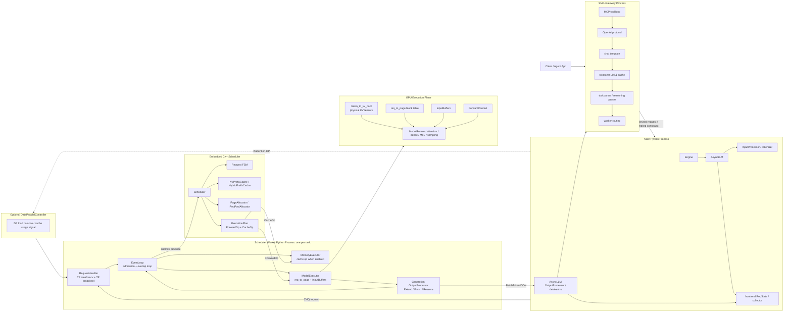

**源码对应关系：**

| 图中组件 | TokenSpeed / SMG 证据 |
|---|---|
| SMG gateway | `python/tokenspeed/cli/serve_smg.py`、`python/tokenspeed/cli/_proc.py`、`analysis/ascend-agent-runtime/07-smg-gateway-runtime.md` |
| AsyncLLM / InputProcessor | `python/tokenspeed/runtime/engine/async_llm.py`、`input_processor.py` |
| RequestHandler / EventLoop | `python/tokenspeed/runtime/engine/request_handler.py`、`event_loop.py` |
| C++ Scheduler / FSM | `tokenspeed-scheduler/csrc/scheduler/*`、`tokenspeed-scheduler/csrc/fsm/*` |
| KV ownership | `tokenspeed-scheduler/csrc/resource/allocator/*`、`kv_prefix_cache/*`、`hybrid_prefix_cache/*` |
| GPU materialization | `python/tokenspeed/runtime/execution/model_executor.py`、`input_buffer.py`、`runtime_states.py` |
| model/parallel path | `python/tokenspeed/runtime/models/deepseek_v4.py`、`runtime/distributed/*` |

### 1.2 vLLM V1：API Server Process + EngineCore + GPU Worker Processes

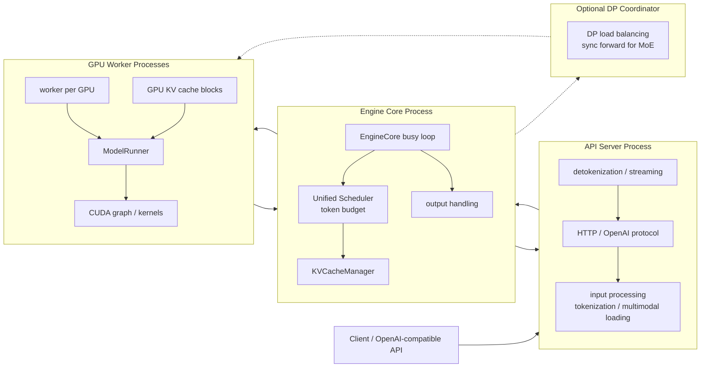

**官方文档事实：**

- vLLM V1 process architecture 包括 API Server Process、Engine Core Process、GPU Worker Processes；DP 时还有 DP Coordinator。
- 官方文档的 process count summary 写明：API Server 处理 HTTP 和 input processing；Engine Core 负责 scheduler 和 KV cache management；GPU Worker 执行 model forward；DP Coordinator 负责 DP rank load balancing。
- vLLM V1 unified scheduler 用 `{request_id: num_tokens}` 形式的 token budget 统一 prompt/output token scheduling，服务 chunked prefill、prefix caching、spec decode。

### 1.3 TensorRT-LLM：LLM/Executor API + PyExecutor/C++ runtime + TensorRT engine

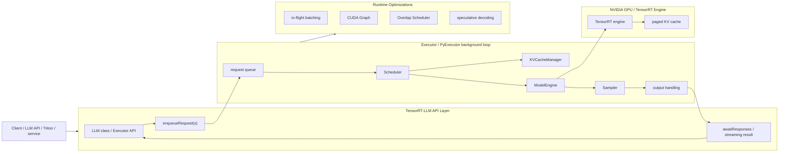

**官方文档事实：**

- TensorRT-LLM architecture 文档把 `LLM` class 描述为核心入口，并说明内部会创建每个 rank 的 `PyExecutor(Worker)` background loop。
- 该 loop 关键组件包括 Scheduler、KVCacheManager、ModelEngine、Sampler。
- Executor API 是 high-level C++ API，支持 async request execution 和 in-flight batching。
- Runtime optimization 包括 CUDA Graph 和 Overlap Scheduler；官方文档描述 Overlap Scheduler 会在 CPU 处理上一轮结果时启动下一轮 GPU work。

### 1.4 整体架构横向对照

| 维度 | TokenSpeed | vLLM V1 | TensorRT-LLM |
|---|---|---|---|
| user-facing gateway | SMG 独立 gateway，处理 protocol/template/parser/tool loop/routing | API Server Process，处理 HTTP/input/output | LLM API / Executor / Triton serving |
| 调度主循环 | Python EventLoop 调 C++ Scheduler | EngineCore busy loop | Executor / PyExecutor background loop |
| scheduler 形态 | 嵌入 worker 的 C++ request FSM + ExecutionPlan | V1 unified scheduler，token budget 表达 | Scheduler 与 KVCacheManager 在 executor loop 内协同 |
| KV 管理边界 | C++ logical page ownership + Python materialization + GPU physical KV | KVCacheManager / BlockPool / KVCacheBlock | KVCacheManager / KVCacheConfig / paged KV / offload/events |
| GPU 执行 | Python ModelExecutor + ModelRunner + custom backends | GPU workers + ModelRunner + kernels/CUDA graph | TensorRT engine / ModelEngine + CUDA Graph |
| agent/tool 边界 | parser/tool loop 在 SMG，engine 不感知 tool object | API/tool examples 支持，engine 侧主要处理 tokenized request | serving/API 层支持 OpenAI examples，runtime 侧以 Executor request 为核心 |
| 需要注意 | DeepSeek V4 hierarchical KVStore 当前不可作为已落地收益 | vLLM V1 已专门重构 CPU/KV 路径 | 强绑定 NVIDIA runtime 和 TensorRT engine |

## 2. 相同问题一：Agent CPU 高负载如何处理

### 2.1 问题本身

Agent workload 的 CPU 高负载不只是“HTTP 请求多”。它通常来自：

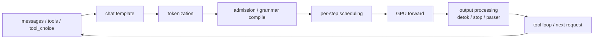

decode step 越短，GPU forward 越快，CPU 侧的固定工作越容易变成 p95 ITL 或 GPU idle gap。比较三个框架时，应该看 CPU 控制面被拆到哪里、哪些动作和 GPU forward overlap、哪些动作仍在请求关键路径上。

### 2.2 TokenSpeed 的处理路径

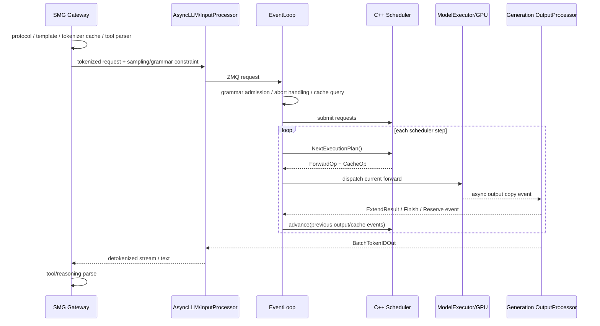

**实现事实：**

- SMG 吃掉一部分 agent-facing CPU 工作：OpenAI protocol、chat template、tokenizer cache、tool parser、MCP loop、routing。
- TokenSpeed engine 的 `GenerateReqInput` 不直接携带原始 tools；进入 engine 后主要是 token ids / text、sampling params、grammar/structural constraint。
- `EventLoop` 把 cache result commit、scheduler plan、cache op submit、forward dispatch、output commit、scheduler.advance 拆开。
- overlap loop 的核心是当前 forward 先 dispatch，再处理上一轮结果，让 CPU postprocess/advance 有机会与 GPU forward overlap。
- C++ Scheduler 负责 request/KV 决策，但模型 forward、InputBuffers、output processing、部分 distributed metadata 仍在 Python worker 里。

**在同一问题下的客观表达：**

```text
TokenSpeed 的 CPU 控制面被分成两段：
  SMG 处理 user-facing agent 协议；
  engine worker 用 EventLoop + C++ Scheduler 处理 token-level scheduling/KV。

需要继续验证的是：
  在真实 short-decode agent workload 下，
  SMG parser/tool loop、AsyncLLM、EventLoop、C++ Scheduler、OutputProcessor
  哪一段是主要 CPU 时间来源。
```

### 2.3 vLLM V1 的处理路径

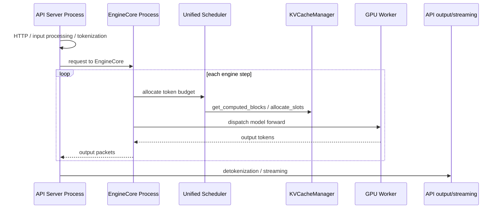

**官方文档事实：**

- vLLM V1 process architecture 将 API server、Engine Core、GPU workers 拆成独立进程。
- API Server Process 处理 HTTP requests 和 input processing；Engine Core Process 管 scheduler 和 KV cache management；GPU Worker 执行 model forward。
- V1 unified scheduler 用 token budget 同时处理 prompt/output tokens，支持 chunked prefill、prefix caching、speculative decoding。
- V1 guide 状态表显示 prefix caching、chunked prefill、FP8 KV cache、spec decode 为 functional；GPU <> CPU KV cache swapping 被移除。

**在同一问题下的客观表达：**

```text
vLLM V1 的 CPU 控制面设计重点是进程拆分和 EngineCore busy loop：
  API/input/output 与 scheduler/model executor 分离；
  scheduler 用统一 token budget 降低 prefill/decode 特例分支；
  GPU worker 承担 forward。

本文不判断其优劣，只记录它不是“单进程 Python scheduler”。
```

### 2.4 TensorRT-LLM 的处理路径

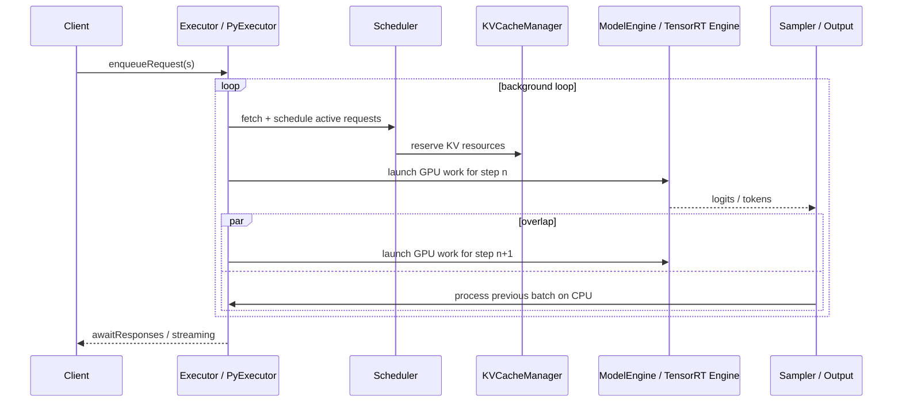

**官方文档事实：**

- Executor API 支持异步请求执行和 in-flight batching。
- PyExecutor background loop 每轮做 request fetching、scheduling、KV resource preparation、model execution、output handling。
- CUDA Graph 用于降低 CPU-side kernel launch overhead。
- Overlap Scheduler 的策略是 CPU 处理当前/上一轮输出时，GPU 已经启动下一步 work；官方文档说默认开启。

**在同一问题下的客观表达：**

```text
TensorRT-LLM 的 CPU 控制面设计重点是 executor/runtime-first：
  request execution 在 Executor/PyExecutor loop 中；
  GPU launch overhead 通过 CUDA Graph 处理；
  CPU result processing 通过 Overlap Scheduler 与下一步 GPU work 重叠。

本文不把该能力迁移到 Ascend 做推断，因为它依赖 NVIDIA runtime/TensorRT engine。
```

### 2.5 CPU 高负载实现对照图

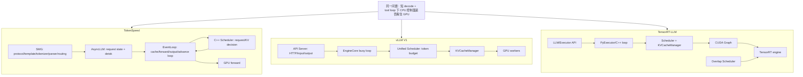

| 对照点 | TokenSpeed | vLLM V1 | TensorRT-LLM |
|---|---|---|---|
| agent protocol / tool parser | SMG gateway | API server/examples/tool calling path | serving/API layer examples |
| tokenization / detokenization | SMG + AsyncLLM output path | API Server Process | LLM class handles pre/post; serving layer depends deployment |
| scheduler CPU path | C++ Scheduler embedded in Python worker | EngineCore Process unified scheduler | Scheduler inside Executor/PyExecutor loop |
| CPU/GPU overlap | EventLoop overlap between forward and previous output/advance | multiprocess API/EngineCore split; persistent batch/chunked prefill per docs | CUDA Graph + Overlap Scheduler |
| still in CPU critical path | parser/tool loop, IPC, EventLoop, output processor, Python materialization | API input/output, EngineCore scheduling, KV manager | executor scheduling, output handling, runtime callbacks |
| unresolved for this report | real CPU time attribution per component | no vLLM source-level profiling here | NVIDIA-specific runtime assumptions |

## 3. 相同问题二：Agent KV 管理如何处理

### 3.1 问题本身

带 tool call 的 agent session 通常不是同一条 request 原地暂停/恢复，而是多轮请求围绕同一段历史上下文反复构造 prompt：

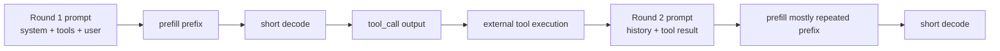

KV 管理要回答的不是“有没有 cache”，而是：

- repeated prefix 如何命中？
- request finish 后哪些 KV 可以成为后续 prefix？
- KV 接近满载时如何 evict / retract / offload / recompute？
- 多 replica 时下一轮请求是否还能落到有 KV locality 的 worker？
- tool call 等待期间是否存在专门 pause/resume 或 DDR offload？

### 3.2 TokenSpeed 的 KV 管理路径

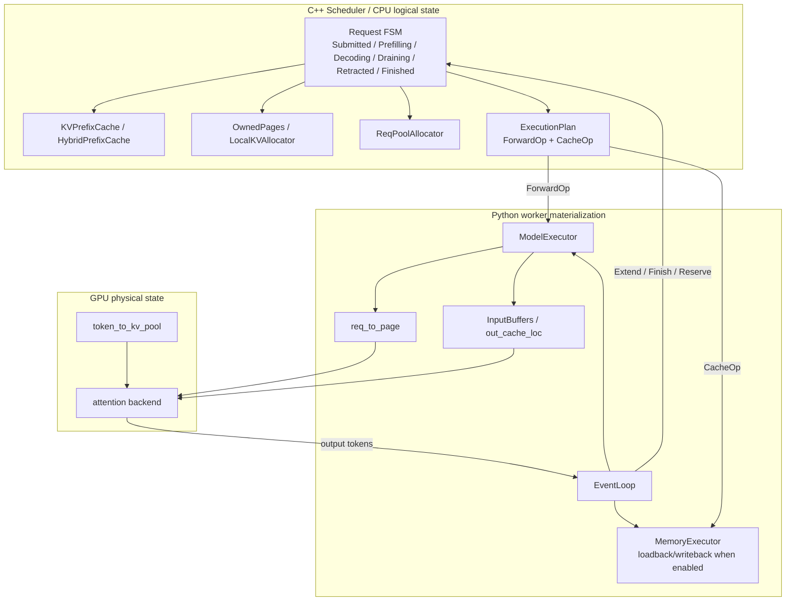

**实现事实：**

- C++ Scheduler 的 request state 携带资源所有权，不只是状态枚举。
- `OwnedPages` 是 move-only RAII page owner，减少 early-free / double-free / ownership 漏转移风险。
- prefix match、device/host page depth、loadback diff、decode reserve、finish insert、writeback/retract 都在 scheduler/FSM 语义里。
- `ExecutionPlan` 同时包含 `ForwardOp` 和 `CacheOp`；Python EventLoop 把二者提交给 ModelExecutor / MemoryExecutor。
- GPU 实际 KV tensor 在 `token_to_kv_pool`；C++ Scheduler 管 logical page ownership，`ModelExecutor` 通过 `req_to_page` 和 `InputBuffers` materialize。
- tool call 本身不会让 engine 进入一个专门状态；tool result 后通常是下一轮新 request，靠 prefix cache / routing / prompt stability 复用。
- DeepSeek V4 当前 path 禁用 hierarchical KVStore，因此 host/L2/L3 loadback/writeback 不应算作 V4 已经可用的 agent KV 优化。

### 3.3 vLLM V1 的 KV 管理路径

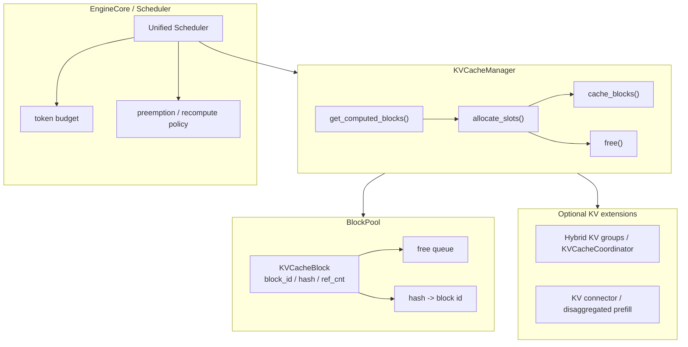

**官方文档事实：**

- vLLM V1 prefix cache 在 KV cache manager 中实现。
- `KVCacheBlock` 包含 immutable block id、block hash、reference count 和 free queue 指针。
- KV cache manager 初始化时预分配 block pool，并维护 free queue、hash key 到 block id、request id 到 block id 的映射。
- scheduler 会调用 `get_computed_blocks()` 查找已计算 prefix，再调用 `allocate_slots()` 分配新 blocks / touch cached blocks / evict LRU blocks。
- request finished 时，ref count 为 0 的 blocks 会被释放进 free queue；cached block 在 free queue head 被重新分配时会被 eviction。
- hybrid KV cache manager 用 `KVCacheCoordinator` 协调 per-group managers。
- disaggregated prefill 通过 connector / buffer / pipe 等抽象转移 KV cache。

### 3.4 TensorRT-LLM 的 KV 管理路径

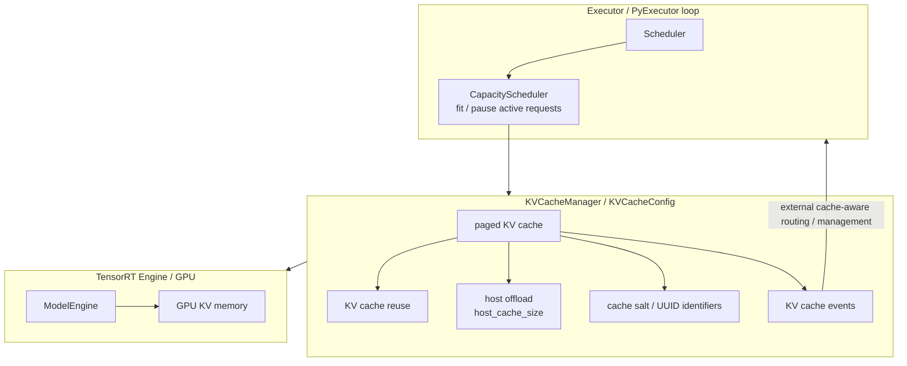

**官方文档事实：**

- TensorRT-LLM KV cache system 通过 `KVCacheConfig` 控制 dtype、GPU memory fraction、host offload 等行为。
- `host_cache_size` 可以启用 host memory offload：block 在从 GPU eviction 前可 offload 到 host，复用时再拷回 GPU。
- KV cache salting 控制哪些请求可以共享 cached KV state，用于隔离不同用户/tenant。
- multimodal UUID 可作为 KV cache event 中的稳定标识。
- scheduler 文档中 `CapacityScheduler` 会根据 KV cache capacity 等资源决定哪些 active requests 适合本步执行，并输出 fitting_requests / paused_requests。
- Executor/architecture 文档中 KVCacheManager 与 Scheduler 在 PyExecutor loop 内协同。

### 3.5 KV 管理实现对照图

```mermaid
flowchart TB
  Q["同一问题：多轮 agent prefix + KV pressure + finish/abort/reuse"]

  subgraph TS["TokenSpeed"]
    TS1["Request FSM owns resource state"]
    TS2["KVPrefixCache / HybridPrefixCache"]
    TS3["OwnedPages / LocalKVAllocator"]
    TS4["ExecutionPlan: ForwardOp + CacheOp"]
    TS5["ModelExecutor materializes req_to_page"]
    TS1 --> TS2 --> TS3 --> TS4 --> TS5
  end

  subgraph VL["vLLM V1"]
    VL1["Scheduler token budget"]
    VL2["KVCacheManager"]
    VL3["BlockPool / KVCacheBlock"]
    VL4["free queue + ref count + block hash"]
    VL5["Hybrid KV / connector"]
    VL1 --> VL2 --> VL3 --> VL4
    VL2 --> VL5
  end

  subgraph TRT["TensorRT-LLM"]
    TR1["Executor Scheduler"]
    TR2["CapacityScheduler"]
    TR3["KVCacheManager / KVCacheConfig"]
    TR4["paged KV reuse"]
    TR5["host offload / events / salting"]
    TR1 --> TR2 --> TR3 --> TR4 --> TR5
  end

  Q --> TS
  Q --> VL
  Q --> TRT
```

| 对照点 | TokenSpeed | vLLM V1 | TensorRT-LLM |
|---|---|---|---|
| KV 基本单位 | page / paged cache group / prefix tree node | block / KVCacheBlock | page/block in KVCacheManager |
| request 与 KV 的绑定 | Request FSM 状态对象携带 allocator/node ref/page ownership | scheduler request 与 KVCacheManager/BlockPool 协同 | Scheduler/CapacityScheduler 与 KVCacheManager 协同 |
| prefix reuse | scheduler prefill 时 prefix match；finish 后可 insert prefix tree | `get_computed_blocks()` + block hash + prefix cache | KV cache reuse，cache salting/UUID 控制共享边界 |
| finish 后处理 | Finish/Draining/WritingBack/Finished 状态推进；是否 writeback 取决于 cache path | `free()` ref count 为 0 blocks；cached blocks 留在 free queue 等待 LRU eviction | cache reuse/offload/event 机制由 KVCacheConfig/manager 控制 |
| KV pressure | retract/loadback/writeback 语义存在；DSV4 hierarchical path 当前受限 | preemption/recompute、LRU eviction、connector/disagg path | CapacityScheduler、paused_requests、host offload |
| tool call 关系 | engine 不感知 tool call object；下一轮靠 prefix/routing | API/tool path 与 engine KV cache 分层 | serving/API 与 Executor request 分层 |
| host/DDR offload | 通用 KVStore/MemoryExecutor 路径存在；DSV4 当前不能计入 | V1 guide 显示 GPU <> CPU KV cache swapping removed；另有 connector/disagg mechanisms | host_cache_size 控制 host offload |
| 外部可观测/路由 | SMG routing 可影响 worker locality；engine KV event 另需具体闭环 | KV events/connector docs存在；本文未深挖路由实现 | KV cache events 可用于外部 cache-aware routing/management |

## 4. 当前文档可支持的客观观察

以下不是竞争力结论，只是从架构图得到的差异描述：

1. **TokenSpeed 把 agent-facing gateway 和 engine 分开。**
   SMG 处理 OpenAI/tool/parser/routing；engine 处理 token-level scheduling/KV/model forward。这个分层会影响如何分析 CPU overhead：不能把 parser 成本算到 C++ Scheduler，也不能把 engine KV reuse 归因给 parser。

2. **三者都有 CPU control-plane 设计。**
   TokenSpeed 是 SMG + EventLoop + C++ Scheduler；vLLM V1 是 API Server + EngineCore + GPU Worker 多进程；TensorRT-LLM 是 Executor/PyExecutor + CUDA Graph + Overlap Scheduler。仅凭“有 C++ Scheduler”不能推出 TokenSpeed 特别。

3. **三者都有成熟 KV 管理元素。**
   TokenSpeed 有 request FSM + page ownership；vLLM 有 KVCacheManager / BlockPool / APC / hybrid KV；TensorRT-LLM 有 KV reuse / offload / events / CapacityScheduler。不能把“有 prefix cache”写成 TokenSpeed 特点。

4. **TokenSpeed 的可讨论差异在语义耦合方式，而不是功能名。**
   具体是 `Request FSM -> KV ownership -> ExecutionPlan -> ModelExecutor materialization -> output feedback -> scheduler.advance` 这一条链路。但这只是实现差异，不自动等于性能优势。

5. **DeepSeek V4 / tool call 场景必须降权 host offload 叙事。**
   代码分析没有看到 tool-call-specific DDR KV offload；DeepSeek V4 hierarchical KVStore 当前受限。因此报告中只能说“通用 runtime 有 cache movement 机制”，不能说“V4 agent tool wait 已支持 DDR KV pause/resume”。

## 5. 面向 PPT 的图页建议

如果把这部分拆成 PPT，不建议先讲“TokenSpeed 哪里更强”。建议按如下图页组织：

1. **三框架整体架构图**
   一页三列：TokenSpeed / vLLM V1 / TensorRT-LLM，标出 gateway/API、scheduler loop、KV manager、GPU execution 的边界。

2. **同一问题：agent CPU 高负载**
   用一张公共问题图说明 CPU overhead 来源，再用三张小图说明三者如何拆分 control plane 和 GPU forward。

3. **同一问题：agent KV 管理**
   用一张 multi-turn tool loop 图说明 repeated prefix，再画三者 KV manager 的实现路径。

4. **事实对照表，而非结论表**
   表头用“组件边界 / 状态所有权 / offload 支持 / tool call 边界 / 未验证项”，不要用“强/弱/结论”。

5. **最后只列开放问题**
   例如：真实 CPU time breakdown、prefix hit under tool loop、worker locality、DSV4 hierarchical KVStore 是否可落地、Ascend 上 MoE dispatch-combine 等价实现。

## 6. 外部资料索引

- vLLM architecture overview: https://docs.vllm.ai/en/stable/design/arch_overview/
- vLLM V1 guide: https://docs.vllm.ai/en/stable/usage/v1_guide/
- vLLM prefix caching: https://docs.vllm.ai/en/v0.11.1/design/prefix_caching/
- vLLM hybrid KV cache manager: https://docs.vllm.ai/en/stable/design/hybrid_kv_cache_manager/
- vLLM disaggregated prefill: https://docs.vllm.ai/en/v0.12.0/features/disagg_prefill/
- TensorRT-LLM architecture: https://nvidia.github.io/TensorRT-LLM/architecture/overview.html
- TensorRT-LLM Executor API: https://nvidia.github.io/TensorRT-LLM/advanced/executor.html
- TensorRT-LLM scheduler: https://nvidia.github.io/TensorRT-LLM/torch/scheduler.html
- TensorRT-LLM KV cache system: https://nvidia.github.io/TensorRT-LLM/features/kvcache.html
