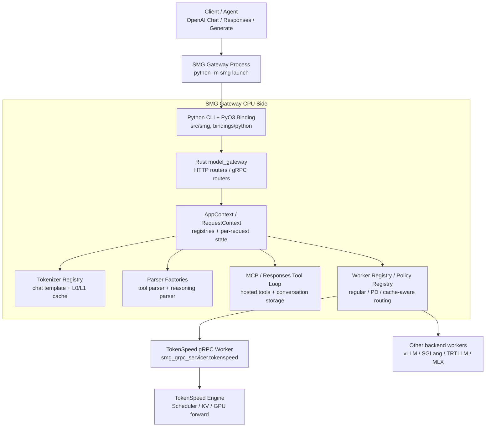
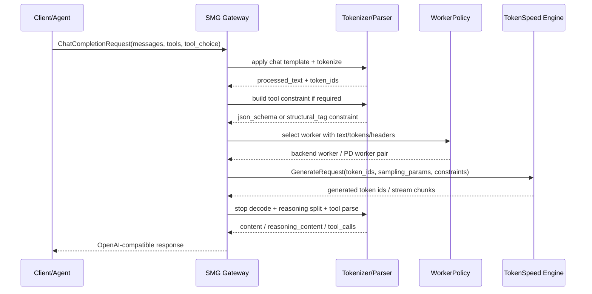

# SMG Gateway 技术拆解 v0.1

更新时间：2026-05-21

本文把 SMG 从 TokenSpeed engine 里单独拆出来分析。这样做的原因很直接：在 `ts serve` 路径里，用户看到的 OpenAI-compatible HTTP、chat template、tokenizer、tool parser、reasoning parser、MCP tool loop、worker routing 并不直接发生在 TokenSpeed C++ Scheduler / GPU execution plane 内，而是由一个独立的 SMG gateway 进程承担。

如果不先拆清楚 SMG，就很容易把三类东西混在一起：

1. **SMG gateway 能力**：协议接入、tokenizer/cache、parser、MCP 工具循环、worker 选择。
2. **TokenSpeed engine 能力**：request FSM、KV page ownership、cache movement、GPU forward、output feedback。
3. **二者之间的接口协议**：SMG 把 chat/messages/tools 变成 `token_ids + sampling_params + constraints`，engine 只看到 tokenized generate request。

## 0. 核心判断

SMG 更像 TokenSpeed 的 **agent-facing control plane / gateway runtime**，不是模型执行后端本身。

```text
Client / Agent
  -> SMG Gateway
       OpenAI protocol / Responses API / chat template / tokenizer
       tool parser / reasoning parser / MCP tool loop / worker routing
  -> TokenSpeed gRPC engine worker
       request FSM / KV ownership / scheduler / model forward / output feedback
  -> SMG Gateway
       detokenize / stop decode / reasoning split / tool_calls formatting
  -> Client / Agent
```

因此，讨论 “TokenSpeed 对 agentic workload 的优化” 时，必须区分：

- **SMG 负责让 agent 请求变成稳定、可路由、可解析的模型请求**；
- **TokenSpeed engine 负责让这些多轮、长 prefix、短 decode 的请求在 KV 和 GPU 上跑得快**；
- 两者的组合价值来自 “gateway 侧 prompt/parser/tool loop 一致性” 与 “engine 侧 KV ownership/reuse” 的闭环，而不是 SMG 自己管理 GPU KV。

## 1. 代码来源与进程边界

当前 TokenSpeed 主仓没有 vendored SMG 源码，只在 Python 包依赖里 pin 了外部包：

- `python/pyproject.toml`
  - `tokenspeed-smg==1.4.1.post20260519`
  - `tokenspeed-smg-grpc-proto==0.4.7.post20260519`
  - `tokenspeed-smg-grpc-servicer==0.5.3.post20260519`

主仓里能看到的是 **启动编排和参数切分**：

- `python/tokenspeed/cli/_proc.py`
  - gateway module 是 `smg`
  - engine module 默认是 `smg_grpc_servicer.tokenspeed`
  - `spawn_gateway()` 拉起 `python -m smg launch --worker-urls grpc://...`
  - `spawn_engine()` 拉起 TokenSpeed gRPC backend worker

- `python/tokenspeed/cli/_argsplit.py`
  - `--host` / `--port` 是 gateway-only
  - `--chat-template` / `--tool-call-parser` 是 gateway-only
  - `--reasoning-parser` 会进入 gateway；在部分路径也会进入 engine，用于 reasoning 之后再触发 grammar 约束

- `python/tokenspeed/cli/serve_smg.py`
  - DeepSeek V4 默认注入 `--tool-call-parser deepseek_v4`
  - DeepSeek V4 默认注入 `--reasoning-parser deepseek_v31`
  - 默认开启 SMG tokenizer L0/L1 cache
  - 先下载 tokenizer artifact，避免 gateway 异步注册 tokenizer 造成冷启动不稳定

本次对 SMG 的实现分析基于 `tokenspeed-smg==1.4.1.post20260519` sdist。这个 sdist 是一个 Rust/maturin workspace，外层有 Python CLI/binding，内部核心是 Rust `model_gateway`。

## 2. SMG 的运行时组件

SMG 的组件可以按四层理解：



### 2.1 Python CLI / binding 层

SMG 对外是 Python module：

- `src/smg/__main__.py`
- `src/smg/router_args.py`
- `src/smg/launch_router.py`
- `bindings/python/src/lib.rs`

`router_args.py` 暴露 gateway 参数，包括：

- chat template / tokenizer path
- tokenizer cache L0/L1
- `--reasoning-parser`
- `--tool-call-parser`
- worker URLs / routing policy / metrics / health 等

`bindings/python/src/lib.rs` 把这些参数接到 Rust `model_gateway` builder，并把 parser choices 暴露给 Python CLI。也就是说，`--tool-call-parser` 的可选值不是 TokenSpeed engine 里定义的，而来自 SMG 的 `tool_parser::ParserFactory`。

### 2.2 Rust model_gateway 层

`model_gateway/src/main.rs` 和 `model_gateway/src/app_context.rs` 构造 gateway runtime。核心对象包括：

- `WorkerRegistry`：管理 backend worker 列表、类型、健康状态、连接模式。
- `PolicyRegistry`：为不同模型维护 routing policy。
- `TokenizerRegistry`：管理 tokenizer、chat template、tokenizer cache。
- `ToolParserFactory`：按模型族选择 tool parser。
- `ReasoningParserFactory`：按模型族选择 reasoning parser。
- MCP / storage / observability 组件：服务 Responses API 和 hosted tools。

`app_context.rs` 还会在启动时校验 configured parser 是否存在，避免运行时才发现 `--tool-call-parser` 配错。

### 2.3 RequestContext / Pipeline 层

SMG 的请求执行不是一个大函数，而是 `RequestPipeline` 分阶段推进。

`model_gateway/src/routers/grpc/context.rs` 定义了：

- `RequestInput`
  - request type
  - headers
  - model id
  - tenant meta
- `SharedComponents`
  - tokenizer registry
  - tool parser factory
  - reasoning parser factory
  - configured tool parser
  - multimodal components
- `ProcessingState`
  - preparation output
  - selected workers
  - selected clients
  - proto request
  - dispatch metadata
  - load guards
  - response state

这个结构很关键：SMG 自己维护的是 **gateway request state**，不是 engine 内的 KV page state。

### 2.4 Worker routing 层

SMG 的 worker routing 在 gateway 侧完成。`model_gateway/src/routers/grpc/common/stages/worker_selection.rs` 会：

1. 从 preparation output 拿到 prompt text 和 token ids；
2. 从 `WorkerRegistry` 取可用 worker；
3. 通过 `PolicyRegistry` 选择 worker；
4. regular 模式选择一个 worker；
5. PD 模式选择 prefill worker + decode worker。

Routing policy 支持 round-robin、random、power-of-two、consistent hashing、prefix hash、cache-aware、bucket、manual、DP-rank load 等策略。这里的价值不在于“某个 policy 名字”，而在于 SMG 可以在 backend admission 之前影响：

- 请求进入哪个 worker / 哪个 DP group；
- 长 prefix 是否尽量打到已有 cache 的 worker；
- PD 模式下 prefill / decode worker 如何配对；
- gateway 侧是否把 worker 健康、load、KV event monitor 纳入选择。

这属于 agent workload 的入口调度层，不等同于 TokenSpeed C++ Scheduler 内部的 micro-batch / KV page 调度。

## 3. 一条 Chat 请求在 SMG 中如何执行

`model_gateway/src/routers/grpc/pipeline.rs` 里 regular chat/generate pipeline 的阶段是：

```text
ChatGeneratePreparationStage
  -> WorkerSelectionStage
  -> ClientAcquisitionStage
  -> ChatGenerateRequestBuildingStage
  -> DispatchMetadataStage
  -> RequestExecutionStage
  -> ChatGenerateResponseProcessingStage
```

对应到请求生命周期：



### 3.1 Preparation：把 chat 请求变成模型 prompt

`regular/stages/chat/preparation.rs` 做了几件事：

1. 从 `TokenizerRegistry` 解析 tokenizer；
2. 按 `tool_choice` 过滤 tools；
3. 对 messages 应用 chat template；
4. tokenize 成 `token_ids`；
5. 对 multimodal 内容做 placeholder / token expansion；
6. 如果 request 带 tools 且 tool_choice 需要强制 tool call，则生成 tool constraint；
7. 构造 stop sequence decoder；
8. 把结果写入 `PreparationOutput::Chat`。

这一步的输出是：

```text
processed_messages.text
token_ids
tool_constraints: Option<(constraint_type, constraint_value)>
```

注意：此时仍在 SMG 内，TokenSpeed engine 还没有看到请求。

### 3.2 Tool constraint：请求侧如何约束模型输出

`crates/tool_parser/src/factory.rs` 定义了两类 tool constraint：

- `JsonSchema(String)`
  - 输出被约束为纯 JSON；
  - 后处理走 generic JSON schema parser；
  - 用于 required / function tool_choice 且模型 parser 不支持 native structural tag 的情况。

- `StructuralTag(String)`
  - 输出包含模型原生 tool-call framing tokens；
  - 后处理走模型专用 parser；
  - 用于 KimiK2、Mistral 等支持 structural tag builder 的 parser。

`generate_tool_constraint()` 的逻辑是：

```text
tools 为空 -> None
tool_choice 是 auto/none -> None
configured parser 支持 structural tag -> StructuralTag
否则 function/required -> JsonSchema
```

这说明 SMG 在请求侧做了一个重要转换：OpenAI tools 并不是原样传给 backend，而是先变成模型 prompt 和 sampling constraint。

### 3.3 Request building：TokenSpeed engine 看到什么

`crates/grpc_client/src/tokenspeed_scheduler.rs` 的 `build_generate_request_from_chat()` 会构造 TokenSpeed-native gRPC request：

```text
GenerateRequest {
  request_id,
  tokenized: {
    original_text: processed_text,
    input_ids: token_ids,
  },
  sampling_params,
  return_logprob,
  stream,
  ...
}
```

tool constraint 会进入 sampling params：

```text
response_format / ebnf / regex / tool_call_constraint
  -> TokenSpeed SamplingParams constraint
```

所以，engine 侧看到的是：

- input ids；
- sampling params；
- grammar / structural constraint；
- stream / logprob 等 generation 参数。

engine 侧看不到的是：

- OpenAI `messages` 的原始结构；
- `tools` 的 OpenAI schema 原文；
- `tool_choice` 的高层语义；
- “这是第几轮 tool loop” 这样的 agent runtime 状态。

这个边界对后续判断很重要：**tool call 不是 TokenSpeed engine 的一等 request type**。

### 3.4 Response processing：把生成文本还原成 OpenAI 响应

`regular/processor.rs` 负责非流式响应处理：

1. 用 stop decoder 把 output ids decode 成文本；
2. 如果 `separate_reasoning` 且 parser 可用，先把 reasoning content 分离出来；
3. 如果 request 带 tools 且 tool_choice 不是 none：
   - 如果请求侧用了 JSON schema constraint，则用 `parse_json_schema_response()`；
   - 否则用模型 tool parser 的 `parse_complete()`；
4. 如果解析出 tool calls，则把 finish reason 改成 `tool_calls`；
5. 组装 `ChatCompletionMessage { content, tool_calls, reasoning_content }`。

`regular/streaming.rs` 负责流式路径。它会为 stream 建独立 parser，用 `parse_incremental()` 逐 chunk 解析 tool-call delta。这里和非流式不同：streaming parser 需要隔离状态，不能复用 pooled parser 的 mutable state。

结论：SMG 的 parser 是 **响应格式恢复层**，负责把模型输出恢复成 OpenAI-compatible fields。它不负责 KV cache，也不参与 engine scheduling。

## 4. Tool Parser 子系统

SMG 的 tool parser 系统不是只有一个 JSON parser，而是模型族 parser registry。

`crates/tool_parser/src/factory.rs` 默认注册了：

- `json`
- `mistral`
- `qwen`
- `qwen_xml`
- `qwen_coder`
- `pythonic`
- `llama`
- `deepseek`
- `deepseek31`
- `deepseek32`
- `deepseek_v4`
- `glm45_moe`
- `glm47_moe`
- `step3`
- `kimik2`
- `minimax_m2`
- `cohere`

并维护模型名到 parser 的 mapping，例如：

- DeepSeek V4 -> `deepseek_v4`
- Kimi-K2 -> `kimik2`
- Qwen3.5 / Qwen3-Coder -> `qwen_xml`
- Qwen3 及更早 -> `qwen`
- Llama 4 -> `pythonic`
- Llama 3.2 -> `llama`

Parser trait 的核心接口是：

```text
parse_complete(output) -> (remaining_normal_text, tool_calls)
parse_incremental(chunk, tools) -> streaming parse result
has_tool_markers(output)
reset()
```

这套设计解决的是 **模型 tool-call 表达不统一** 的问题：

- DeepSeek / Qwen / Kimi / Llama 的 tool-call framing 不同；
- 有些模型更适合 JSON schema 约束；
- 有些模型需要保留特殊 marker token；
- streaming 输出需要 incremental parser；
- non-streaming 可以完整解析后再产出 tool_calls。

对 vLLM / vLLM-Ascend 的复制难度判断：

- **单个 parser**：通常是 model patch / gateway patch，可复制；
- **parser registry + request-side constraint + response-side parsing 的一致性**：需要 gateway 层系统化实现；
- **parser 与 tokenizer cache、chat template、Responses/MCP tool loop 的闭环**：不是简单后端 config，需要 frontend/gateway 架构配合；
- **engine KV 复用收益**：parser 本身不能提供，必须依赖后端 runtime 能稳定复用下一轮 prefix。

## 5. Responses API 与 MCP Tool Loop

SMG 不只处理 ChatCompletion，还处理 Responses API。`regular/responses/non_streaming.rs` 的核心路径是：

```text
route_responses_internal()
  -> load_conversation_history()
  -> ensure_mcp_connection()
  -> if has_mcp_tools:
       execute_tool_loop()
     else:
       execute_without_mcp()
  -> persist_response_if_needed()
```

### 5.1 没有 MCP hosted tools

如果没有 MCP hosted tools，SMG 会：

1. 把 `ResponsesRequest` 转成 `ChatCompletionRequest`；
2. 执行普通 chat pipeline；
3. 把 `ChatCompletionResponse` 转回 `ResponsesResponse`；
4. 如果需要，持久化 response / conversation item。

这条路径里 function tools 通常返回给 client/agent，由外部 agent 执行工具后再发下一轮消息。

### 5.2 有 MCP hosted tools

如果 request 中有 MCP hosted tools，SMG 会进入 `execute_tool_loop()`：

1. 创建 MCP session；
2. 把 MCP tools 转成 chat tools；
3. 每轮把当前 `ResponsesRequest` 转成 chat request；
4. 准备 tools/tool_choice；
5. 执行 chat pipeline；
6. 从 chat response 里解析 tool calls；
7. 如果没有 tool calls，返回最终 response；
8. 如果有 tool calls，执行 MCP tools；
9. 用 tool result 构造下一轮 request；
10. 直到无 tool call 或达到 iteration / max_tool_calls 限制。

这说明 SMG 确实有 agent runtime 的一部分：**hosted tool loop orchestration**。

但这里有一个关键边界：

```text
MCP tool loop 是 gateway 发起下一轮 backend request，
不是 TokenSpeed engine 内部把同一个 request pause 后 resume。
```

因此，目前不能说 TokenSpeed 有 “tool call 后把该请求 KV 自动搬到 DDR，tool result 回来再 loadback” 的专用机制。已看到的实现是：

- SMG 管理 tool loop 和下一轮请求；
- TokenSpeed engine 管理每一轮 backend request 的 KV；
- 两轮之间能否复用 prefix KV，取决于 engine prefix cache / worker routing / prompt 稳定性，而不是 SMG 直接持有 GPU KV page。

## 6. SMG 对 agent workload 的真实优化点

SMG 对 agentic workload 的价值不是“加速一个 kernel”，而是让多轮 agent 请求进入后端前变得更稳定、更可路由、更可解析。

### 6.1 Prompt / tokenizer 稳定性

Agent 请求通常包含：

- 长 system prompt；
- 多轮 conversation history；
- tool schema；
- tool result；
- reasoning / tool-call marker；
- 短 decode step。

如果每一轮 chat template 或 tool schema rendering 不稳定，后端 prefix cache 很难命中。SMG 在 gateway 侧统一 chat template、tokenizer、tool constraint 和 parser，有利于稳定同一条 conversation 的 prefix 形态。

TokenSpeed 主仓 `serve_smg.py` 默认打开 SMG tokenizer L0/L1 cache，并在注释中提到 tokenizer L1 prefix cache 对 mm25 end-to-end TTFT 有明显帮助。这类收益是 CPU/gateway 侧 TTFT 收益，和 engine KV cache 收益不是同一件事，但两者会叠加到用户看到的 TTFT 上。

### 6.2 Tool-call 格式确定性

Tool-call 对 agent 的影响不是只在输出字段上，而是会改变 decode 形态：

- required tool_choice 需要模型尽快产出结构化结果；
- structural tag 需要保留模型原生 marker；
- JSON schema constraint 会改变 sampling path；
- streaming parser 需要避免把半截 tool argument 当普通 content 发出去。

SMG 的 request-side constraint + response-side parser 把这些差异收敛在 gateway 层，降低了 engine 需要理解每种模型 tool 格式的复杂度。

### 6.3 Worker routing 与 prefix locality

Agent 多轮请求最怕的是下一轮打到另一个 worker，导致 prefix KV 无法复用。SMG routing policy 可以使用 text/tokens/headers/hash ring/KV event monitor 影响 worker 选择。

这给 TokenSpeed engine 的 prefix cache 创造了前提：

```text
稳定 prompt rendering
  + 稳定 worker routing
  + engine prefix cache
  -> 多轮 agent 的 TTFT / p95 更可能下降
```

如果只复制 engine 的 prefix cache，而 gateway 每轮乱路由，收益会被冲掉；如果只复制 SMG routing，而 backend 没有可用的 prefix reuse，收益也有限。

### 6.4 Gateway tool loop 降低外部编排开销

Responses + MCP hosted tools 的内部 tool loop 可以减少 client / external agent 与 serving backend 之间的往返编排复杂度。它不直接减少模型 decode FLOPs，但可能减少：

- client-side orchestration latency；
- repeated protocol conversion；
- tool metadata 拼接错误；
- 多轮 request 的状态丢失。

不过，这部分收益要通过 counter 证明，不能直接等同于 GPU throughput 提升。

## 7. SMG 与 TokenSpeed engine 的职责切分

| 问题 | 属于 SMG | 属于 TokenSpeed engine | 判断 |
|---|---|---|---|
| OpenAI Chat / Responses 协议 | 是 | 否 | SMG 是 user-facing gateway |
| chat template / tokenizer | 是 | engine 可接收 tokenized input | `ts serve` 下主要在 SMG |
| tokenizer L0/L1 cache | 是 | 否 | CPU/gateway TTFT 优化 |
| tool schema 处理 | 是 | 否 | engine 只看到 constraint |
| tool parser | 是 | 否 | 非流式 `parse_complete`，流式 `parse_incremental` |
| reasoning parser | 是，部分参数也进入 engine | 部分用于 grammar 延迟触发 | 需要按路径拆开 |
| MCP hosted tool loop | 是 | 否 | SMG 构造下一轮 backend request |
| request FSM / admission | 否 | 是 | TokenSpeed C++ Scheduler |
| KV page ownership | 否 | 是 | TokenSpeed Scheduler / memory pool |
| prefix KV reuse | 间接影响 worker/prompt | 直接实现 | 两者组合决定收益 |
| cache writeback/loadback | 否 | 是，但 DSV4 hierarchical KVStore 仍有未落地边界 | 不应归因给 SMG |
| GPU forward / MoE / TP/EP | 否 | 是 | engine execution plane |

## 8. 对 vLLM / vLLM-Ascend 的复制难度

SMG 这一层要拆成三种复制难度。

### 8.1 config / model patch 可复制

这些相对容易：

- 增加某个模型的 tool-call parser；
- 为 DeepSeek V4 / Kimi-K2 配默认 parser；
- 调整 chat template；
- 支持 JSON schema / structural tag 的某些请求格式；
- 把 stream chunk 解析成 tool-call delta。

如果 vLLM 已经有对应模型 parser 或插件式 parser，这些不是强护城河。

### 8.2 gateway 架构可复制，但不是后端 config

这些需要一个较完整的 gateway 层：

- parser registry；
- tokenizer registry 和 tokenizer cache；
- OpenAI Chat / Responses / Generate 多协议转换；
- MCP hosted tool loop；
- conversation / response persistence；
- worker registry / health / draining / policy routing；
- regular / PD pipeline 差异。

vLLM 可以复制，但通常不是加一个 engine flag 就完成，而是要在 serving frontend / router / gateway 中形成同等抽象。

### 8.3 需要和 engine 协议共同设计

这些最难：

- gateway routing 如何感知 backend KV locality；
- cache-aware policy 如何消费 backend KV event；
- PD routing 如何与 backend prefill/decode worker 语义对齐；
- grammar / structural constraint 如何进入 engine sampling path；
- reasoning parser 与 engine grammar 延迟触发如何一致；
- 多轮 agent request 如何保持 worker affinity 并稳定命中 prefix cache。

这部分不是 SMG 单独能完成，也不是 engine 单独能完成。它是 gateway + engine 的接口协议问题。

## 9. 性能 counter 应该怎么验证

SMG 的收益不应该用 “TPM/GPU 提升” 单独衡量，因为它主要影响 gateway TTFT、路由命中、tool loop latency 和后端 prefix locality。建议至少拆这些 counter：

| Counter | 归因 | 预期移动方向 | 解释 |
|---|---|---|---|
| gateway request prepare latency | SMG | 降低 | tokenizer cache / template cache 生效 |
| tokenizer L0/L1 hit rate | SMG | 提高 | 多轮 agent prefix 稳定后应提升 |
| tool parser latency | SMG | 可控 | parser 不应成为短 decode 的 p95 放大器 |
| tool loop iteration latency | SMG | 降低或稳定 | MCP hosted tool loop 的编排开销 |
| worker routing affinity | SMG | 提高 | 同 conversation / prefix 尽量落同 worker |
| backend prefix cache hit rate | SMG + engine | 提高 | SMG 间接影响，engine 直接实现 |
| backend prefill tokens saved | engine，受 SMG 影响 | 提高 | 多轮长 prefix 场景应减少重复 prefill |
| p95 TTFT | SMG + engine | 降低 | gateway prepare + backend prefix reuse 共同作用 |
| p95 ITL | engine 为主 | 不退化 | parser/streaming 不应拖慢 chunk 输出 |
| worker load skew / DP skew | SMG + engine | 降低 | routing policy 不应为了 cache hit 造成严重倾斜 |

对于架构竞争力判断，SMG 相关性能信号可以这样理解：

1. tokenizer L0/L1 cache 主要影响 gateway prepare latency 和 TTFT，不应归因到 engine KV。
2. routing policy 只有在提高 backend prefix locality 时，才和 engine KV reuse 形成组合竞争力。
3. function tools 与 MCP hosted tools 的差异属于 agent runtime / gateway orchestration，不是 engine pause/resume。
4. parser parse_complete / parse_incremental 更偏兼容性和尾延迟风险，不是核心护城河。
5. 多 worker / 多 DP 下的关键是 cache hit 与 load skew 的 tradeoff，而不是单独的平均吞吐。

## 10. 当前结论与报告写法建议

SMG 应在报告里单独成节，不能被折叠进 “Scheduler/KV ownership” 或 “tool-call parser 小功能”。

建议报告中这样定位：

```text
SMG 是 TokenSpeed 面向 agent workload 的 gateway runtime：
它不直接管理 GPU KV，但它决定请求如何被模板化、tokenized、约束、解析、路由和循环调用工具。
它的价值在于让 engine 的 KV reuse / scheduler 优化有稳定输入和路由前提。
```

同时也要控制边界：

- 不说 SMG 自己提供 GPU KV offload；
- 不说 tool call 是 engine 内的一等状态；
- 不把 parser 当成主要护城河；
- 不把 gateway TTFT 收益和 engine KV 收益混为一谈；
- 重点分析 SMG 与 engine 接口如何服务 agentic long-prefix / short-decode workload。

最终对 vLLM/vLLM-Ascend 的判断是：

```text
SMG 的单点 parser 和协议转换容易复制；
完整 gateway runtime 可以复制但需要前端架构投入；
最有价值、也最难复制的是 gateway routing / tokenizer stability / parser constraints
与 backend KV reuse、PD/DP routing、sampling constraints 之间的系统接口。
```
